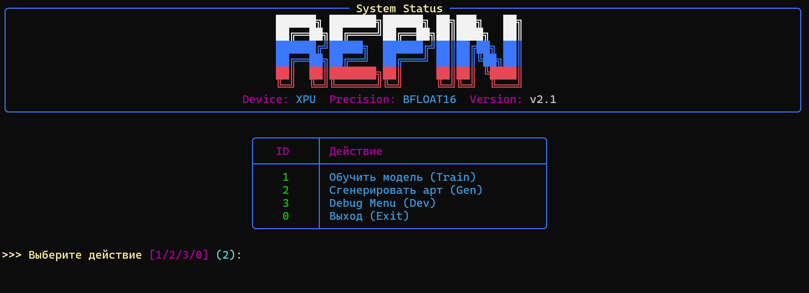
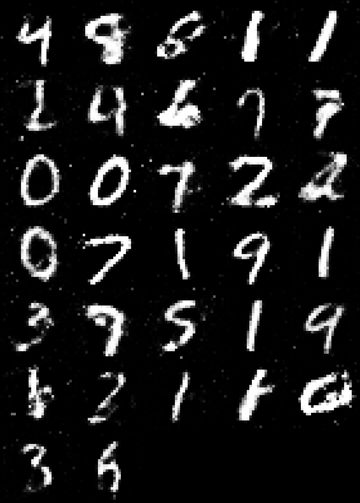
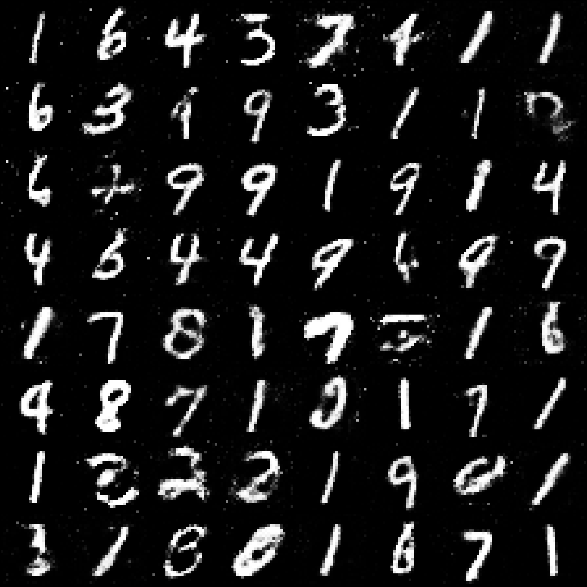

# 🎨 Repin 2.0: Generative Digital Art Studio
<p align="center">
  <svg xmlns="http://www.w3.org/2000/svg" viewBox="0 0 900 350" width="100%" height="100%">
      <defs>
          <linearGradient id="r-grad" x1="0%" y1="0%" x2="0%" y2="100%">
              <stop offset="0%" stop-color="#00e5ff" />
              <stop offset="50%" stop-color="#0055ff" />
              <stop offset="100%" stop-color="#ff00ff" />
          </linearGradient>
          <linearGradient id="text-grad" x1="0%" y1="0%" x2="100%" y2="100%">
              <stop offset="0%" stop-color="#ffffff" />
              <stop offset="100%" stop-color="#b8c6e5" />
          </linearGradient>
          <linearGradient id="line-grad" x1="0%" y1="0%" x2="100%" y2="0%">
              <stop offset="0%" stop-color="#ff00ff" stop-opacity="0.8"/>
              <stop offset="50%" stop-color="#00e5ff" stop-opacity="0.5"/>
              <stop offset="100%" stop-color="#00ff88" stop-opacity="0.1"/>
          </linearGradient>
          <filter id="glow" x="-20%" y="-20%" width="140%" height="140%">
              <feGaussianBlur stdDeviation="6" result="blur" />
              <feMerge>
                  <feMergeNode in="blur" />
                  <feMergeNode in="blur" />
                  <feMergeNode in="SourceGraphic" />
              </feMerge>
          </filter>
          <filter id="glow-subtle" x="-20%" y="-20%" width="140%" height="140%">
              <feGaussianBlur stdDeviation="3" result="blur" />
              <feMerge>
                  <feMergeNode in="blur" />
                  <feMergeNode in="SourceGraphic" />
              </feMerge>
          </filter>
          <style>
              @import url('https://fonts.googleapis.com/css2?family=Space+Grotesk:wght@700&amp;family=JetBrains+Mono:wght@400;700&amp;display=swap');
              @keyframes pulse-opacity {
                  0%, 100% { fill-opacity: 0.1; transform: scale(0.9); }
                  50% { fill-opacity: 0.8; transform: scale(1.05); }
              }
              @keyframes flow {
                  to { stroke-dashoffset: -40; }
              }
              @keyframes float {
                  0%, 100% { transform: translateY(0px); }
                  50% { transform: translateY(-8px); }
              }
              @keyframes flicker {
                  0%, 19%, 21%, 23%, 25%, 54%, 56%, 100% { opacity: 1; text-shadow: 0 0 10px #00ff88, 0 0 20px #00ff88; }
                  20%, 24%, 55% { opacity: 0.5; text-shadow: none; }
              }
              .anim-float { animation: float 6s ease-in-out infinite; }
              .data-flow { stroke-dasharray: 6 12; animation: flow 1s linear infinite; }
              .data-flow-slow { stroke-dasharray: 4 15; animation: flow 2s linear infinite reverse; }
              .noise-pixel { transform-origin: center; transform-box: fill-box; animation: pulse-opacity 2s ease-in-out infinite; }
              .version-text { animation: flicker 7s infinite; }
              .font-title { font-family: 'Space Grotesk', sans-serif; font-weight: 700; }
              .font-mono { font-family: 'JetBrains Mono', monospace; }
          </style>
      </defs>
      <g opacity="0.4" class="anim-float">
          <path d="M 50 175 Q 150 50 350 175 T 850 175" fill="none" stroke="#2a2d3e" stroke-width="1" />
          <path d="M 50 175 Q 150 300 350 175 T 850 175" fill="none" stroke="#2a2d3e" stroke-width="1" />
          <circle cx="150" cy="112" r="2" fill="#4a5070" />
          <circle cx="250" cy="112" r="2" fill="#4a5070" />
          <circle cx="150" cy="238" r="2" fill="#4a5070" />
          <circle cx="250" cy="238" r="2" fill="#4a5070" />
      </g>
      <g class="anim-float">
          <g opacity="0.7">
              <path d="M 280 120 L 360 120" fill="none" stroke="url(#line-grad)" stroke-width="3" class="data-flow" />
              <path d="M 280 180 L 360 180" fill="none" stroke="url(#line-grad)" stroke-width="2" class="data-flow" style="animation-duration: 1.5s;" />
              <path d="M 280 240 L 360 240" fill="none" stroke="url(#line-grad)" stroke-width="1.5" class="data-flow-slow" />
          </g>
          <g transform="translate(100, 75)" fill="url(#r-grad)" filter="url(#glow)">
              <rect x="-24" y="24" width="20" height="20" rx="4" class="noise-pixel" style="animation-delay: 0.1s;" />
              <rect x="-48" y="96" width="20" height="20" rx="4" class="noise-pixel" style="animation-delay: 0.5s;" />
              <rect x="144" y="0" width="20" height="20" rx="4" class="noise-pixel" style="animation-delay: 0.3s;" />
              <rect x="120" y="168" width="20" height="20" rx="4" class="noise-pixel" style="animation-delay: 0.7s;" />
              <rect x="48" y="192" width="20" height="20" rx="4" class="noise-pixel" style="animation-delay: 0.2s;" />
              <rect x="0" y="0" width="20" height="20" rx="4" />
              <rect x="24" y="0" width="20" height="20" rx="4" />
              <rect x="48" y="0" width="20" height="20" rx="4" />
              <rect x="72" y="0" width="20" height="20" rx="4" />
              <rect x="96" y="0" width="20" height="20" rx="4" />
              <rect x="0" y="24" width="20" height="20" rx="4" />
              <rect x="120" y="24" width="20" height="20" rx="4" />
              <rect x="0" y="48" width="20" height="20" rx="4" />
              <rect x="120" y="48" width="20" height="20" rx="4" />
              <rect x="0" y="72" width="20" height="20" rx="4" />
              <rect x="24" y="72" width="20" height="20" rx="4" />
              <rect x="48" y="72" width="20" height="20" rx="4" />
              <rect x="72" y="72" width="20" height="20" rx="4" />
              <rect x="96" y="72" width="20" height="20" rx="4" />
              <rect x="0" y="96" width="20" height="20" rx="4" />
              <rect x="72" y="96" width="20" height="20" rx="4" />
              <rect x="0" y="120" width="20" height="20" rx="4" />
              <rect x="96" y="120" width="20" height="20" rx="4" />
              <rect x="0" y="144" width="20" height="20" rx="4" />
              <rect x="120" y="144" width="20" height="20" rx="4" />
              <rect x="0" y="168" width="20" height="20" rx="4" />
              <rect x="120" y="168" width="20" height="20" rx="4" />
          </g>
          <g transform="translate(380, 160)">
              <text x="0" y="0" class="font-title" font-size="88" fill="url(#text-grad)" letter-spacing="6">REPIN</text>
              <text x="325" y="0" class="font-title version-text" font-size="88" fill="#00ff88" filter="url(#glow-subtle)">2.0</text>
              <text x="5" y="45" class="font-mono" font-size="20" fill="#6a7894" letter-spacing="4" font-weight="700">GENERATIVE DIGITAL ART STUDIO</text>
          </g>
          <g transform="translate(385, 240)" class="font-mono" font-size="12" font-weight="700">
              <rect x="0" y="0" width="90" height="28" rx="6" fill="#151320" stroke="#ff0055" stroke-width="1.5" />
              <text x="45" y="18" fill="#ff0055" text-anchor="middle" filter="url(#glow-subtle)">NOISE (z)</text>
              <path d="M 96 14 L 124 14" fill="none" stroke="#4a5070" stroke-width="1.5" class="data-flow" />
              <rect x="130" y="0" width="110" height="28" rx="6" fill="#101820" stroke="#00e5ff" stroke-width="1.5" />
              <text x="185" y="18" fill="#00e5ff" text-anchor="middle" filter="url(#glow-subtle)">GENERATOR (G)</text>
              <path d="M 246 14 L 274 14" fill="none" stroke="#4a5070" stroke-width="1.5" class="data-flow" />
              <rect x="280" y="0" width="90" height="28" rx="6" fill="#101a15" stroke="#00ff88" stroke-width="1.5" />
              <text x="325" y="18" fill="#00ff88" text-anchor="middle" filter="url(#glow-subtle)">ART (224x)</text>
          </g>
      </g>
  </svg>
</p>


[](https://www.python.org/)
[](https://pytorch.org/)
[](LICENSE)
[](https://github.com/Textualize/rich)
[](https://zzzigrok.github.io/repin-2.0/)

**Repin 2.0** — это профессиональная GAN-студия для создания цифрового искусства на базе архитектуры MNIST GAN. Проект сочетает в себе мощь PyTorch и эстетичный CLI-интерфейс, превращая генерацию нейросетевых изображений в творческий процесс.

### 🌐 [Посетите наш сайт-визитку](https://zzzigrok.github.io/repin-2.0/)



---

## 🖼 Галерея генераций
Здесь представлены примеры работы модели, сгенерированные через встроенный CLI:

| Batch 32 (Showcase) | Batch 64 (Showcase) |
|:---:|:---:|
|  |  |

---

## 🚀 Основные возможности
- **Интуитивный CLI**: Полноценное интерактивное меню на базе библиотеки `rich`.
- **Высокая производительность**: Оптимизировано для `torch.xpu` (Intel GPU) и поддерживает `bfloat16`.
- **Debug Menu**: Встроенные инструменты для бенчмаркинга и инспекции архитектуры модели.
- **Масштабирование**: Автоматическое увеличение сгенерированных изображений в 8 раз (до 224x224) без потери четкости.

## 📖 Документация
Мы подготовили исчерпывающие руководства для пользователей и разработчиков:

- [🚀 **Быстрый старт**](docs/tutorials/getting_started.md) — создайте свой первый арт за минуту.
- [🧠 **Архитектура**](docs/architecture.md) — технические подробности устройства GAN.
- [⚙️ **Использование CLI**](docs/usage.md) — подробное описание команд и флагов.
- [🛠 **Устранение неполадок**](docs/troubleshooting.md) — если что-то пошло не так.
- [🎓 **Полное оглавление**](docs/INDEX.md) — навигация по всей базе знаний.

## 🛠 Установка и запуск

### 1. Клонирование репозитория
```bash
git clone https://github.com/zzzigrok/repin-2.0.git
cd repin-2.0
```

### 2. Установка зависимостей
```bash
pip install -r requirements.txt
```

### 3. Запуск
```bash
# Запуск интерактивного меню
python cli.py
```

## 📁 Структура проекта
- `cli.py` — единый файл приложения (логика + интерфейс).
- `docs/` — техническая документация, туториалы и ассеты.
- `weights/` — директория с весами модели.
- `generated_art/` — галерея ваших работ.
- `web/` — исходный код сайта-визитки.

## 🤝 Участие в разработке
Мы приветствуем вклад в развитие проекта! См. [CONTRIBUTING.md](docs/CONTRIBUTING.md) для получения подробностей.

---
<sub>Разработано в рамках TAS Beta. Repin Project • 2026</sub>

