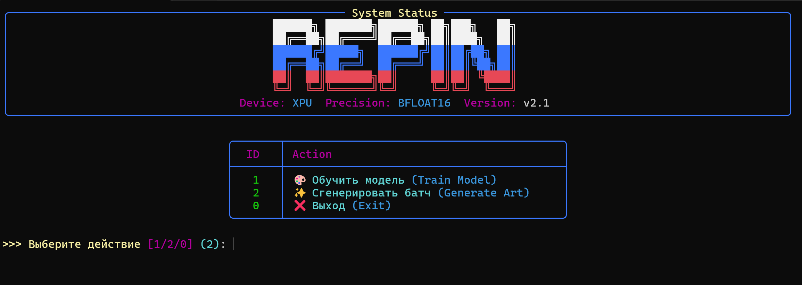

# 🎨 Repin 2.0: Generative Digital Art Studio

[](https://www.python.org/)
[](https://pytorch.org/)
[](LICENSE)
[](https://github.com/Textualize/rich)

**Repin 2.0** — это профессиональная GAN-студия для создания цифрового искусства на базе архитектуры MNIST GAN. Проект сочетает в себе мощь PyTorch и эстетичный CLI-интерфейс, превращая генерацию нейросетевых изображений в творческий процесс.



---

## 🚀 Основные возможности
- **Интуитивный CLI**: Полноценное интерактивное меню на базе библиотеки `rich`.
- **Высокая производительность**: Оптимизировано для `torch.xpu` (Intel GPU) и поддерживает `bfloat16`.
- **Быстрый старт**: Предобученные веса включены в репозиторий.
- **Масштабирование**: Автоматическое увеличение сгенерированных изображений в 8 раз (до 224x224) без потери четкости.

## 📖 Документация
Мы подготовили исчерпывающие руководства для пользователей и разработчиков:

- [🚀 **Быстрый старт**](docs/tutorials/getting_started.md) — создайте свой первый арт за минуту.
- [🧠 **Архитектура**](docs/architecture.md) — технические подробности устройства GAN.
- [⚙️ **Использование CLI**](docs/usage.md) — подробное описание команд и флагов.
- [🛠 **Устранение неполадок**](docs/troubleshooting.md) — если что-то пошло не так.
- [🎓 **Полное оглавление**](docs/INDEX.md) — навигация по всей базе знаний.

## 🛠 Установка и запуск

### 1. Клонирование репозитория
```bash
git clone https://github.com/username/repin-2.0.git
cd repin-2.0
```

### 2. Установка зависимостей
```bash
pip install -r requirements.txt
```

### 3. Запуск
```bash
# Запуск интерактивного меню
python cli.py

# Справка по командам
python cli.py --help
```

## 📁 Структура проекта
- `cli.py` — единый файл приложения (логика + интерфейс).
- `docs/` — техническая документация, туториалы и ассеты.
- `weights/` — директория с весами модели (Repin 2.0 Core).
- `generated_art/` — галерея ваших работ.
- `web/` — исходный код сайта-визитки.
- `data/` — локальное хранилище MNIST.

## 🤝 Участие в разработке
Мы приветствуем вклад в развитие проекта! См. [CONTRIBUTING.md](docs/CONTRIBUTING.md) для получения подробностей.

---
<sub>Разработано в рамках TAS Beta. Repin Project • 2026</sub>
