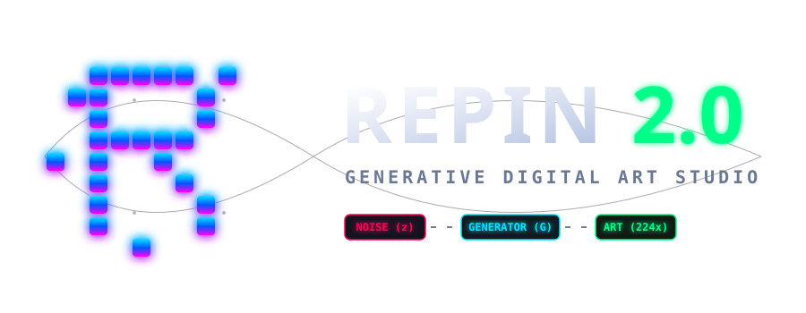

# 🎨 Repin 2.0: Generative Digital Art Studio
<p align="center">
  
</p>


[](https://www.python.org/)
[](https://pytorch.org/)
[](LICENSE)
[](https://github.com/Textualize/rich)
[](https://zzzigrok.github.io/repin-2.0/)

**Repin 2.0** — это открытый исследовательский проект (Open Source), созданный для изучения Генеративно-состязательных сетей (GAN). Проект ориентирован на студентов и начинающих разработчиков в сфере Machine Learning, предоставляя прозрачную реализацию классической архитектуры MNIST GAN с современными оптимизациями.

### 🌐 [Посетите наш сайт-визитку](https://zzzigrok.github.io/repin-2.0/)


---

## 🔬 Исследовательский фокус
- **Прозрачность**: Чистый и задокументированный код на PyTorch, идеально подходящий для изучения основ Deep Learning.
- **Эксперименты**: Удобная настройка гиперпараметров и встроенные инструменты бенчмаркинга.
- **Обучение**: Пошаговые руководства по обучению моделей «с нуля» до получения первых результатов.

---

## 🚀 Основные возможности
- **Интуитивный CLI**: Полноценное интерактивное меню на базе библиотеки `rich`.
- **Высокая производительность**: Оптимизировано для `torch.xpu` (Intel GPU) и поддерживает `bfloat16`.
- **Debug Menu**: Встроенные инструменты для инспекции архитектуры и анализа весов.
- **Art Upscaling**: Демонстрация применения GAN в генеративном искусстве через 8-кратное увеличение (224x224).

## 📖 Документация
Мы подготовили исчерпывающие руководства для обучения и разработки:

- [🚀 **Быстрый старт**](docs/tutorials/getting_started.md) — запустите свою первую модель за минуту.
- [🧠 **Архитектура**](docs/architecture.md) — разбор устройства GAN и функций потерь.
- [🎓 **Обучение**](docs/tutorials/training.md) — руководство по тренировке модели.
- [⚙️ **Использование CLI**](docs/usage.md) — описание интерфейса управления.
- [🛠 **Устранение неполадок**](docs/troubleshooting.md) — решение типичных проблем.

## 🛠 Установка и запуск

### 1. Клонирование репозитория
```bash
git clone https://github.com/zzzigrok/repin-2.0.git
cd repin-2.0
```

### 2. Установка зависимостей
```bash
pip install -r requirements.txt
```

### 3. Запуск
```bash
# Запуск интерактивного меню
python cli.py
```

## 📁 Структура проекта
- `cli.py` — единый файл приложения (логика обучения + интерфейс).
- `docs/` — техническая документация и образовательные материалы.
- `weights/` — предобученные веса генератора (`repin_weights.pth`).
- `generated_art/` — результаты работы вашей нейросети.
- `web/` — исходный код сайта проекта.

## 🤝 Участие в разработке
Проект создан сообществом для сообщества. Мы будем рады вашим Pull Requests, будь то исправление опечаток в документации или предложение новых архитектурных решений. См. [CONTRIBUTING.md](docs/CONTRIBUTING.md) для деталей.

---
<sub>Разработано в рамках TAS Beta. Repin Project • 2026</sub>

