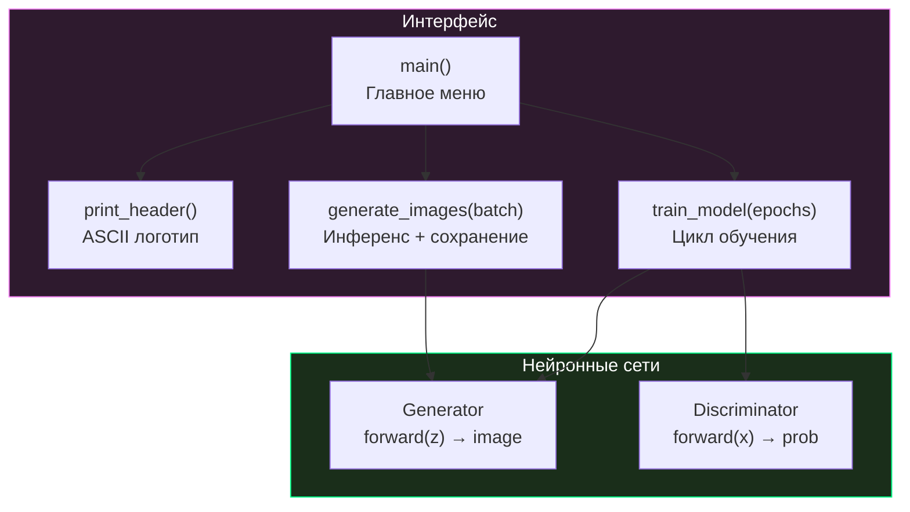

# 🤝 Руководство контрибьютора (Contributing Guide)

> [!NOTE]
> Спасибо за интерес к проекту Repin 2.0! Этот документ описывает, как вы можете внести свой вклад — от исправления опечаток до добавления новых функций.

## 📋 Оглавление
1. [🏗 Принципы проекта](#-принципы-проекта)
2. [🚀 Быстрый старт для разработчика](#-быстрый-старт-для-разработчика)
3. [📐 Стиль кода](#-стиль-кода)
4. [🔀 Процесс Pull Request](#-процесс-pull-request)
5. [📂 Структура кода](#-структура-кода)
6. [🧪 Тестирование](#-тестирование)
7. [📝 Документация](#-документация)
8. [💡 Идеи для контрибуций](#-идеи-для-контрибуций)

---

## 🏗 Принципы проекта

Прежде чем вносить изменения, ознакомьтесь с ключевыми принципами:

| Принцип | Описание |
| :--- | :--- |
| **Единый файл** | Вся логика модели и CLI живёт в `cli.py`. Не разделяйте на модули без согласования. |
| **Rich UI** | Любые изменения интерфейса должны использовать библиотеку `rich`. |
| **XPU-first** | Поддержка `torch.xpu` и `bfloat16` — приоритет при оптимизации. |
| **Простота** | Проект должен быть понятен начинающему разработчику ML. |
| **Русский язык** | UI и документация — на русском. Комментарии в коде — допускаются на обоих языках. |

---

## 🚀 Быстрый старт для разработчика

### 1. Fork и клонирование

```bash
# Fork репозитория через GitHub UI, затем:
git clone https://github.com/<your-username>/repin-2.0.git
cd repin-2.0
```

### 2. Настройка окружения

```bash
python -m venv .venv
# Windows:
.venv\Scripts\activate
# Linux/macOS:
source .venv/bin/activate

pip install torch torchvision rich
```

### 3. Проверка работоспособности

```bash
python cli.py
# Должен открыться интерактивный интерфейс
```

### 4. Создание ветки

```bash
git checkout -b feature/ваше-описание
# Пример: git checkout -b feature/conditional-gan
```

---

## 📐 Стиль кода

### Python

| Правило | Пример |
| :--- | :--- |
| **Именование переменных** | `snake_case`: `batch_size`, `g_loss` |
| **Именование классов** | `PascalCase`: `Generator`, `Discriminator` |
| **Именование констант** | `UPPER_SNAKE_CASE`: `WEIGHTS_PATH`, `OUTPUT_DIR` |
| **Строковые литералы** | Одинарные кавычки: `'cpu'`, `'xpu'` |
| **F-строки** | Для форматирования: `f"Loss: {loss:.2f}"` |
| **Комментарии** | Перед логическими блоками: `# --- АРХИТЕКТУРА ---` |
| **Rich стилизация** | Markup внутри строк: `"[bold green]Текст[/bold green]"` |

### Структура `cli.py`

```
cli.py
├── Импорты (torch, torchvision, rich, stdlib)
├── 1. Аппаратная настройка (device detection)
├── 2. Настройки модели (константы)
├── 3. Архитектура (Generator, Discriminator)
├── 4. Функции интерфейса (print_header, train_model, generate_images)
├── 5. Главный цикл (main)
└── if __name__ == "__main__": (точка входа)
```

> [!IMPORTANT]
> Всегда сохраняйте эту структуру при редактировании. Секции помечены комментариями вида `# --- N. НАЗВАНИЕ ---`.

---

## 🔀 Процесс Pull Request

### Чеклист перед отправкой PR

```
[ ] Код работает: python cli.py запускается без ошибок
[ ] Обучение работает: можно обучить модель хотя бы 1 эпоху
[ ] Генерация работает: можно сгенерировать батч
[ ] Rich-стилизация сохранена: меню, прогресс-бары, цвета
[ ] Структура cli.py не нарушена: 5 секций на месте
[ ] Комментарии актуальны
[ ] Документация обновлена (если изменения затрагивают API)
```

### Формат коммитов

```
feat: добавлена генерация конкретной цифры
fix: исправлен расчёт nrow для нечётных batch_size
docs: расширен раздел troubleshooting
style: унифицированы цвета Rich-панелей
perf: оптимизирован цикл обучения (pin_memory)
```

### Процесс ревью


---

## 📂 Структура кода

### Карта функций



### Важные паттерны

#### Autocast для смешанной точности

```python
with torch.autocast(device_type=device_type, dtype=torch.bfloat16):
    # Все операции внутри блока используют bfloat16
    outputs = D(images)
```

> [!WARNING]
> `torch.autocast` не поддерживает все операции в bfloat16. Loss-функции (`BCELoss`) и операции сравнения автоматически используют float32.

#### Detach для остановки градиентов

```python
outputs = D(fake_images.detach())  # Градиенты НЕ идут в Generator
```

Это предотвращает обновление весов генератора при обучении дискриминатора.

---

## 🧪 Тестирование

### Минимальная проверка

```bash
# 1. Проверка запуска
python -c "from cli import Generator, Discriminator; print('OK')"

# 2. Проверка инференса
python -c "
import torch
from cli import Generator, latent_size
G = Generator()
z = torch.randn(1, latent_size)
out = G(z)
print(f'Output shape: {out.shape}')  # Ожидается: [1, 784]
assert out.shape == (1, 784)
print('Test PASSED')
"

# 3. Проверка полного цикла (быстрая, 1 эпоха)
# Запустите cli.py, выберите [1], введите 1 эпоху, затем [2] для генерации
```

### Проверка документации

```bash
# Убедитесь, что все ссылки между документами работают
# Все файлы в docs_repin/ существуют и содержат актуальную информацию
```

---

## 📝 Документация

### Правила документирования

1. **Язык:** Русский (с англоязычными техническими терминами)
2. **Формат:** GitHub-flavored Markdown
3. **Диаграммы:** Mermaid.js
4. **Навигация:** Каждый файл имеет ссылки «Назад» и «Далее»
5. **Алерты:** Используйте `> [!TIP]`, `> [!NOTE]`, `> [!WARNING]`, `> [!IMPORTANT]`, `> [!CAUTION]`

### Шаблон нового документа

```markdown
# 🎯 Заголовок документа

> [!NOTE]
> Краткое описание содержания.

## 📋 Оглавление
1. [Раздел 1](#раздел-1)
2. [Раздел 2](#раздел-2)

---

## Раздел 1
Содержание...

## Раздел 2
Содержание...

<p align="center">
  <a href="предыдущий.md">← Назад</a> | <a href="следующий.md">Далее →</a><br/>
  <sub>Repin 2.0 • Название • 2026</sub>
</p>
```

---

## 💡 Идеи для контрибуций

### Для начинающих (Good First Issue)

| Задача | Сложность | Описание |
| :--- | :---: | :--- |
| Исправление опечаток в документации | ⭐ | Просто и полезно |
| Добавление docstring к функциям | ⭐ | Следуйте стилю Google |
| Улучшение ASCII-арта логотипа | ⭐⭐ | Креатив приветствуется |
| Добавление цветовых схем MNIST | ⭐⭐ | Colormap для сгенерированных цифр |

### Средний уровень

| Задача | Сложность | Описание |
| :--- | :---: | :--- |
| Промежуточные чекпоинты | ⭐⭐⭐ | Сохранение весов каждые N эпох |
| Conditional GAN | ⭐⭐⭐ | Генерация конкретной цифры 0–9 |
| Learning Rate Scheduler | ⭐⭐ | Автоматическое уменьшение lr |
| Сохранение метрик в CSV | ⭐⭐ | История D_Loss / G_Loss по эпохам |

### Продвинутый уровень

| Задача | Сложность | Описание |
| :--- | :---: | :--- |
| Переход на DCGAN | ⭐⭐⭐⭐ | Свёрточная архитектура |
| FID Score | ⭐⭐⭐⭐ | Метрика качества генерации |
| Экспорт ONNX | ⭐⭐⭐ | Кросс-платформенный инференс |
| Web UI (Gradio) | ⭐⭐⭐⭐ | Браузерный интерфейс |

<p align="center">
  <a href="INDEX.md">← Назад: Главная</a><br/>
  <sub>Repin 2.0 • Contributing Guide • 2026</sub>
</p>
