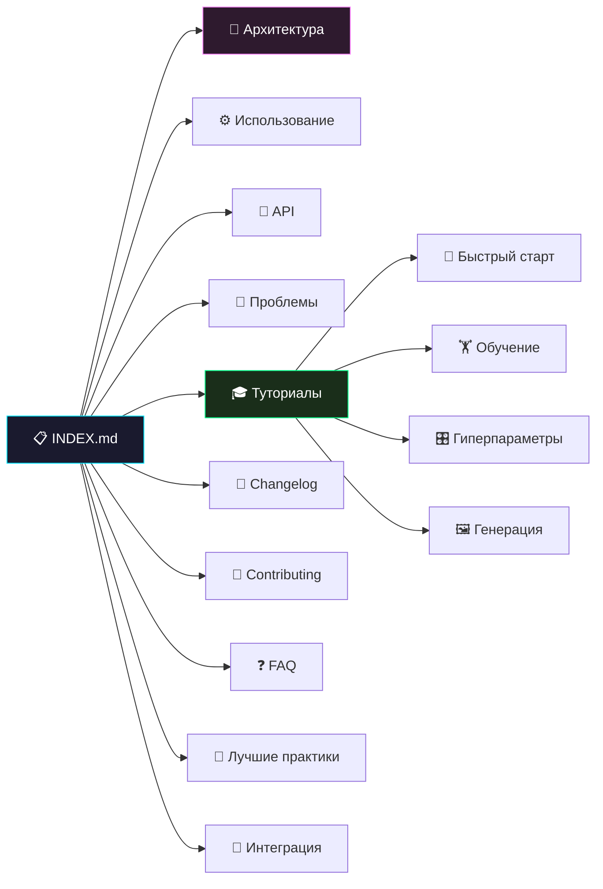

# 🎨 Repin 2.0: Генеративное Искусство на базе GAN
<p align="center">
  
</p>


> [!TIP]
> **Repin 2.0** — это открытая исследовательская платформа на базе Генеративно-состязательных сетей (GAN), созданная для студентов и начинающих специалистов в области Machine Learning. Наша цель — сделать изучение Deep Learning увлекательным, прозрачным и доступным через практическую работу с датасетом MNIST.

## 📋 Полное оглавление

### Основная документация
1. [🧠 Архитектура системы](architecture.md) — глубокое погружение в нейронные сети, математику потерь и потоки данных.
2. [⚙️ Руководство по использованию](usage.md) — как работать с CLI-интерфейсом и его возможностями.
3. [📡 Справочник API](api_reference.md) — детальное описание всех классов, функций и параметров.
4. [🔧 Решение проблем](troubleshooting.md) — диагностика и устранение неполадок.

### Туториалы
5. [🎓 Список туториалов](tutorials/README.md) — пошаговые инструкции для быстрого старта.
6. [🚀 Быстрый старт](tutorials/getting_started.md) — первая генерация за минуту.
7. [🏋️ Обучение с нуля](tutorials/training.md) — полный цикл обучения GAN.
8. [🎛 Гиперпараметры](tutorials/hyperparameters.md) — настройка обучения для достижения лучших результатов.
9. [🖼 Руководство по генерации](tutorials/generation_guide.md) — продвинутые техники генерации арта.

### Для разработчиков
10. [📝 История изменений](CHANGELOG.md) — все версии и релизы проекта.
11. [🤝 Руководство контрибьютора](CONTRIBUTING.md) — как внести вклад в проект.
12. [❓ FAQ](faq.md) — часто задаваемые вопросы.
13. [🌟 Лучшие практики](best_practices.md) — советы по настройке и использованию.
14. [🔌 Интеграция](integration.md) — примеры интеграции с ботами и API.
15. [📚 Глоссарий](#-глоссарий) — основные термины и понятия.

---

## 🔬 Исследовательская философия

Вместо закрытых систем мы предлагаем полностью прозрачный инструмент. **Repin 2.0** — это не просто генератор картинок, а учебное пособие, которое позволяет:
- **Разобраться в MLP**: Увидеть, как полносвязные слои преобразуют шум в осмысленные формы.
- **Освоить PyTorch**: Изучить современные практики написания тренировочных циклов и оптимизации моделей.
- **Протестировать железо**: Испробовать возможности ускорения вычислений на Intel XPU и других архитектурах.

Мы верим, что открытость кода и знаний — это кратчайший путь к инновациям в ИИ.

### Ключевые особенности

| Функция | Описание |
| :--- | :--- |
| **Open Source** | Полностью открытый исходный код с подробными комментариями. |
| **Intel XPU** | Автодетекция и использование `torch.xpu` для аппаратного ускорения на Intel GPU. |
| **bfloat16** | Обучение на современной смешанной точности для экономии ресурсов. |
| **Interactive CLI** | Инструментарий на базе `rich` для визуального контроля процесса обучения. |
| **Educational Docs** | Набор материалов, объясняющих "почему" и "как", а не только "что нажать". |

---

## 🛠 Быстрая установка

### Системные требования

| Компонент | Минимум | Рекомендуется |
| :--- | :--- | :--- |
| **Python** | 3.8+ | 3.10+ |
| **PyTorch** | 2.0 | 2.1+ |
| **ОЗУ** | 4 ГБ | 8 ГБ |
| **Диск** | 500 МБ (данные + веса) | 1 ГБ |
| **GPU** | — (CPU подходит) | Intel XPU (Arc/Flex) |

### Установка

```bash
# 1. Клонируйте репозиторий
git clone https://github.com/zzzigrok/repin-2.0.git
cd repin-2.0

# 2. (Рекомендуется) Создайте виртуальное окружение
python -m venv .venv
# Windows:
.venv\Scripts\activate
# Linux/macOS:
source .venv/bin/activate

# 3. Установите зависимости
pip install torch torchvision rich
```

---

## 📂 Структура проекта

```
Repin 2.0/
├── cli.py                 # Логика нейросети и CLI интерфейс
├── README.md              # Краткое описание проекта
├── LICENSE                # Лицензия MIT
├── GEMINI.md              # Инструкции для ИИ-агентов
│
├── weights/               # Предобученные веса генератора
│   └── repin_weights.pth  # Файл весов (~2.1 МБ)
│
├── data/                  # Директория для датасета MNIST
│
├── generated_art/         # Результаты вашей генерации
│
├── web/                   # Исходный код сайта проекта
│
└── docs/                  # Техническая документация
    ├── INDEX.md           # ← Вы здесь
    ├── architecture.md    # Описание GAN
    ├── usage.md           # Работа с CLI
    └── tutorials/         # Пошаговые гайды
```

---

## 🔗 Схема навигации по документации



---

## 🧠 Глоссарий

| Термин | Описание |
| :--- | :--- |
| **GAN** | Generative Adversarial Network — архитектура из двух конкурирующих нейросетей. |
| **Generator** | Нейросеть, создающая новые данные из случайного шума. |
| **Discriminator** | Нейросеть-«критик», обучающаяся отличать реальные данные от сгенерированных. |
| **MNIST** | Классическая база данных 70 000 рукописных цифр (28×28 пикселей). |
| **Latent Vector** | Вектор скрытого пространства (шум), из которого Генератор создает изображение. |
| **Latent Space** | Многомерное пространство, из которого Генератор сэмплирует входные данные. |
| **Epoch** | Один полный проход по всему тренировочному датасету. |
| **Batch** | Подмножество данных, обрабатываемое за один шаг оптимизации. |
| **BCELoss** | Binary Cross-Entropy Loss — функция потерь для бинарной классификации. |
| **AdamW** | Продвинутый оптимизатор с decoupled weight decay регуляризацией. |
| **bfloat16** | Brain Floating Point — 16-битный формат, оптимизированный для глубокого обучения. |
| **Upscaling** | Увеличение разрешения изображения (28×28 → 224×224). |
| **Nearest Neighbor** | Метод интерполяции, сохраняющий резкость пикселей при увеличении. |
| **MLP** | Multi-Layer Perceptron — полносвязная нейронная сеть прямого распространения. |
| **XPU** | Универсальный ускоритель Intel для вычислений на GPU. |
| **Weight Decay** | Техника регуляризации, предотвращающая переобучение модели. |

---

## 🗺 Roadmap

| Версия | Статус | Описание |
| :--- | :--- | :--- |
| **1.0** | ✅ Завершена | Базовый GAN + CLI интерфейс |
| **2.0** | ✅ Текущая | Art Upscaling, bfloat16, Intel XPU, Rich CLI |
| **2.1** | 🔜 Планируется | Conditional GAN (генерация конкретной цифры), сохранение промежуточных чекпоинтов |
| **3.0** | 💡 Идея | Convolutional GAN (DCGAN), генерация в высоком разрешении |

<p align="center">
  <a href="architecture.md">Далее: Архитектура системы →</a><br/>
  <sub>Repin 2.0 • Documentation • 2026</sub>
</p>
