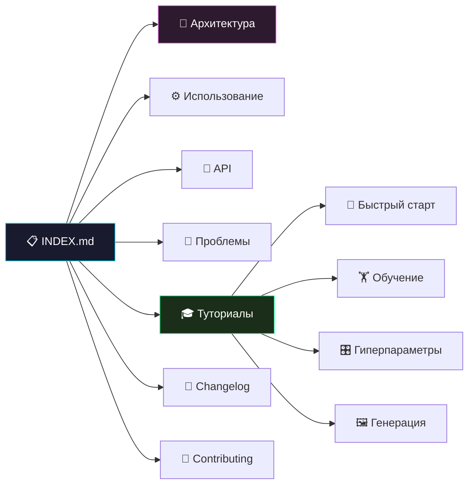

# 🎨 Repin 2.0: Генеративное Искусство на базе GAN

> [!TIP]
> **Repin 2.0** — это продвинутая система на базе Генеративно-состязательных сетей (GAN), предназначенная для создания цифрового искусства на основе датасета MNIST. Проект сочетает в себе мощь PyTorch и эстетику пиксель-арта.

## 📋 Полное оглавление

### Основная документация
1. [🧠 Архитектура системы](architecture.md) — глубокое погружение в нейронные сети, математику потерь и потоки данных.
2. [⚙️ Руководство по использованию](usage.md) — как работать с CLI-интерфейсом и его возможностями.
3. [📡 Справочник API](api_reference.md) — детальное описание всех классов, функций и параметров.
4. [🔧 Решение проблем](troubleshooting.md) — диагностика и устранение неполадок.

### Туториалы
5. [🎓 Список туториалов](tutorials/README.md) — пошаговые инструкции для быстрого старта.
6. [🚀 Быстрый старт](tutorials/getting_started.md) — первая генерация за минуту.
7. [🏋️ Обучение с нуля](tutorials/training.md) — полный цикл обучения GAN.
8. [🎛 Гиперпараметры](tutorials/hyperparameters.md) — настройка обучения для достижения лучших результатов.
9. [🖼 Руководство по генерации](tutorials/generation_guide.md) — продвинутые техники генерации арта.

### Для разработчиков
10. [📝 История изменений](CHANGELOG.md) — все версии и релизы проекта.
11. [🤝 Руководство контрибьютора](CONTRIBUTING.md) — как внести вклад в проект.
12. [📚 Глоссарий](#-глоссарий) — основные термины и понятия.

---

## 🚀 О проекте

Проект **Repin 2.0** назван в честь великого русского художника Ильи Репина — мастера реализма и автора картин, ставших символами русской культуры. Как Репин создавал образы, передающие всю глубину человеческих эмоций, так и наша нейросеть учится создавать из хаоса случайного шума узнаваемые визуальные паттерны.

Цель проекта — превратить простые рукописные цифры в объекты цифрового искусства с помощью апскейлинга и глубокого обучения, продемонстрировав при этом фундаментальные принципы работы генеративно-состязательных сетей.

### Ключевые особенности

| Функция | Описание |
| :--- | :--- |
| **Intel XPU** | Автодетекция и использование `torch.xpu` для аппаратного ускорения на Intel GPU. |
| **bfloat16** | Смешанная точность: быстрое обучение без заметной потери качества генерации. |
| **Интерактивный CLI** | Полноцветный интерфейс на базе `rich` — панели, прогресс-бары, таблицы. |
| **Art Upscaling** | Nearest-Neighbor увеличение 28×28 → 224×224 с эффектом «цифровой мозаики». |
| **Гибкий batch size** | Генерация от 1 до 64 изображений за один запуск. |
| **Автосохранение** | Веса модели и арт-результаты сохраняются автоматически с метками времени. |

---

## 🛠 Быстрая установка

### Системные требования

| Компонент | Минимум | Рекомендуется |
| :--- | :--- | :--- |
| **Python** | 3.8+ | 3.10+ |
| **PyTorch** | 2.0 | 2.1+ |
| **ОЗУ** | 4 ГБ | 8 ГБ |
| **Диск** | 500 МБ (данные + веса) | 1 ГБ |
| **GPU** | — (CPU подходит) | Intel XPU (Arc/Flex) |
| **ОС** | Windows 10 / Linux | Windows 11 / Ubuntu 22.04+ |

### Установка

```bash
# 1. Клонируйте репозиторий
git clone https://github.com/user/repin-2.0.git
cd repin-2.0

# 2. (Рекомендуется) Создайте виртуальное окружение
python -m venv .venv
# Windows:
.venv\Scripts\activate
# Linux/macOS:
source .venv/bin/activate

# 3. Установите зависимости
pip install torch torchvision rich
```

### Проверка установки

```bash
# Должен запуститься интерактивный интерфейс
python cli.py
```

> [!NOTE]
> При первом запуске обучения датасет MNIST (~11 МБ) будет загружен автоматически в папку `data/`.

---

## 📂 Структура проекта

```
Repin 2.0/
├── cli.py                 # Единый файл — модель + CLI интерфейс
├── repin_weights.pth      # Сохранённые веса генератора (~2.1 МБ)
├── README.md              # Краткое описание проекта
├── LICENSE                # Лицензия MIT
├── GEMINI.md              # Инструкции для ИИ-агентов
│
├── data/                  # Автоматически скачанный MNIST
│   └── MNIST/
│       └── raw/           # Сырые данные датасета
│
├── generated_art/         # Результаты генерации
│   └── repin_batch_*.png  # PNG-файлы с метками времени
│
└── docs_repin/            # Документация проекта
    ├── INDEX.md           # ← Вы здесь
    ├── architecture.md    # Архитектура GAN
    ├── usage.md           # Руководство по CLI
    ├── api_reference.md   # Справочник API
    ├── troubleshooting.md # Решение проблем
    ├── CHANGELOG.md       # История изменений
    ├── CONTRIBUTING.md    # Руководство контрибьютора
    └── tutorials/         # Пошаговые руководства
        ├── README.md
        ├── getting_started.md
        ├── training.md
        ├── hyperparameters.md
        └── generation_guide.md
```

---

## 🔗 Схема навигации по документации



---

## 🧠 Глоссарий

| Термин | Описание |
| :--- | :--- |
| **GAN** | Generative Adversarial Network — архитектура из двух конкурирующих нейросетей. |
| **Generator** | Нейросеть, создающая новые данные из случайного шума. |
| **Discriminator** | Нейросеть-«критик», обучающаяся отличать реальные данные от сгенерированных. |
| **MNIST** | Классическая база данных 70 000 рукописных цифр (28×28 пикселей). |
| **Latent Vector** | Вектор скрытого пространства (шум), из которого Генератор создает изображение. |
| **Latent Space** | Многомерное пространство, из которого Генератор сэмплирует входные данные. |
| **Epoch** | Один полный проход по всему тренировочному датасету. |
| **Batch** | Подмножество данных, обрабатываемое за один шаг оптимизации. |
| **BCELoss** | Binary Cross-Entropy Loss — функция потерь для бинарной классификации. |
| **AdamW** | Продвинутый оптимизатор с decoupled weight decay регуляризацией. |
| **bfloat16** | Brain Floating Point — 16-битный формат, оптимизированный для глубокого обучения. |
| **Upscaling** | Увеличение разрешения изображения (28×28 → 224×224). |
| **Nearest Neighbor** | Метод интерполяции, сохраняющий резкость пикселей при увеличении. |
| **MLP** | Multi-Layer Perceptron — полносвязная нейронная сеть прямого распространения. |
| **XPU** | Универсальный ускоритель Intel для вычислений на GPU. |
| **Weight Decay** | Техника регуляризации, предотвращающая переобучение модели. |

---

## 🗺 Roadmap

| Версия | Статус | Описание |
| :--- | :--- | :--- |
| **1.0** | ✅ Завершена | Базовый GAN + CLI интерфейс |
| **2.0** | ✅ Текущая | Art Upscaling, bfloat16, Intel XPU, Rich CLI |
| **2.1** | 🔜 Планируется | Conditional GAN (генерация конкретной цифры), сохранение промежуточных чекпоинтов |
| **3.0** | 💡 Идея | Convolutional GAN (DCGAN), генерация в высоком разрешении |

<p align="center">
  <a href="architecture.md">Далее: Архитектура системы →</a><br/>
  <sub>Repin 2.0 • Documentation • 2026</sub>
</p>
