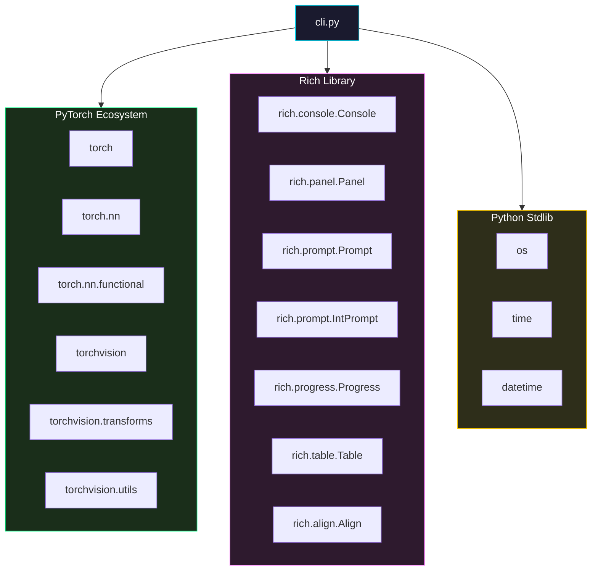
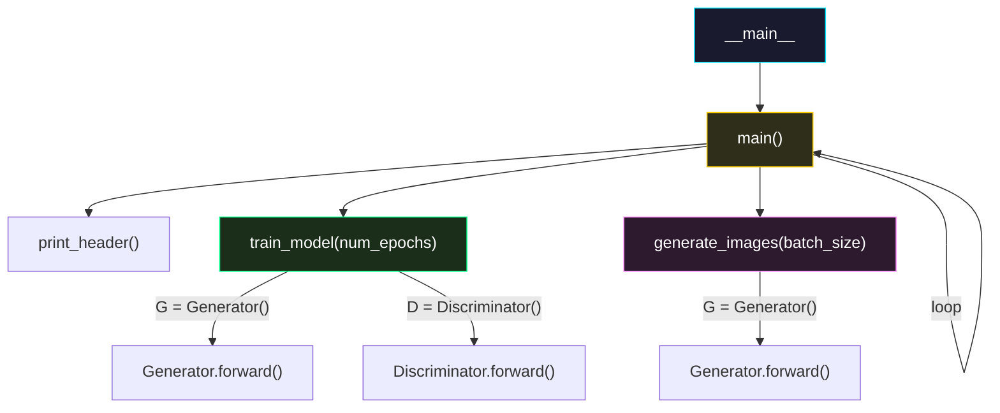

# 📡 Справочник API (API Reference)

> [!NOTE]
> Полная документация всех классов, функций и констант в `cli.py`. Repin 2.0 следует принципу «единого файла» — вся логика модели и интерфейса находится в одном модуле.

## 📋 Оглавление
1. [📦 Константы и конфигурация](#-константы-и-конфигурация)
2. [🧠 Классы нейронных сетей](#-классы-нейронных-сетей)
3. [⚙️ Функции интерфейса](#-функции-интерфейса)
4. [🔌 Точка входа](#-точка-входа)
5. [📊 Диаграмма зависимостей](#-диаграмма-зависимостей)

---

## 📦 Константы и конфигурация

### Аппаратные переменные

| Переменная | Тип | Значение | Описание |
| :--- | :--- | :--- | :--- |
| `device` | `str` | `'cpu'` или `'xpu'` | Устройство вычислений. Определяется автоматически. |
| `device_type` | `str` | `'cpu'` или `'xpu'` | Дублирует `device` для совместимости с `torch.autocast`. |
| `console` | `Console` | `Console()` | Глобальный экземпляр `rich.Console` для всего вывода. |

#### Логика определения устройства

```python
device = 'cpu'
device_type = 'cpu'
if hasattr(torch, "xpu") and torch.xpu.is_available():
    device = 'xpu'
    device_type = 'xpu'
else:
    torch.set_num_threads(6)  # Оптимизация для CPU
```

> [!IMPORTANT]
> `torch.set_num_threads(6)` вызывается **только** если XPU недоступен. На XPU количество потоков CPU не влияет на производительность.

### Параметры модели

| Константа | Тип | Значение | Описание |
| :--- | :--- | :--- | :--- |
| `latent_size` | `int` | `64` | Размерность вектора шума (вход генератора) |
| `hidden_size` | `int` | `256` | Базовый размер скрытых слоёв |
| `image_size` | `int` | `784` | Размер развёрнутого изображения (28 × 28) |
| `WEIGHTS_PATH` | `str` | `'repin_weights.pth'` | Путь для сохранения/загрузки весов генератора |
| `OUTPUT_DIR` | `str` | `'generated_art'` | Директория для сохранения результатов генерации |

---


## 🧠 Классы нейронных сетей

### `Generator`
Класс генератора (наследует `nn.Module`).

```python
class Generator(nn.Module):
    def __init__(self, latent_size, hidden_size, image_size): ...
    def forward(self, x): ...
```

**Пример использования в коде:**
```python
# Инициализация
gen = Generator(latent_size=64, hidden_size=256, image_size=784).to(device)
# Создание батча случайного шума (например, 16 картинок)
noise = torch.randn(16, 64, device=device)
# Получение сырых тензоров изображений
fake_images = gen(noise)
# fake_images.shape будет [16, 784]
```

### `Discriminator`
Класс дискриминатора (наследует `nn.Module`).

```python
class Discriminator(nn.Module):
    def __init__(self, image_size, hidden_size): ...
    def forward(self, x): ...
```

**Пример использования в коде:**
```python
# Инициализация
disc = Discriminator(image_size=784, hidden_size=256).to(device)
# Оценка картинок (fake_images из примера выше)
predictions = disc(fake_images)
# predictions.shape будет [16, 1], значения от 0.0 до 1.0
```


### `class Generator(nn.Module)`

Генеративная нейросеть, преобразующая случайный шум в изображение.

#### Архитектура

```python
self.net = nn.Sequential(
    nn.Linear(latent_size, hidden_size),        # 64 → 256
    nn.ReLU(),
    nn.Linear(hidden_size, hidden_size * 2),    # 256 → 512
    nn.ReLU(),
    nn.Linear(hidden_size * 2, image_size),     # 512 → 784
    nn.Tanh()
)
```

#### Метод `forward(x)`

| Параметр | Тип | Размерность | Описание |
| :--- | :--- | :--- | :--- |
| `x` (вход) | `torch.Tensor` | `[B, 64]` | Батч латентных векторов |
| **return** | `torch.Tensor` | `[B, 784]` | Батч сгенерированных изображений (плоских) |

**Диапазон значений:** `[-1, 1]` (благодаря `Tanh` на выходе)

#### Количество параметров

| Слой | Параметры (веса) | Параметры (bias) | Итого |
| :--- | :--- | :--- | :--- |
| Linear(64, 256) | 16 384 | 256 | 16 640 |
| Linear(256, 512) | 131 072 | 512 | 131 584 |
| Linear(512, 784) | 401 408 | 784 | 402 192 |
| **Всего** | | | **550 416** |

---

### `class Discriminator(nn.Module)`

Классификатор, определяющий реальность изображения (реальное MNIST или подделка генератора).

#### Архитектура

```python
self.net = nn.Sequential(
    nn.Linear(image_size, hidden_size * 2),     # 784 → 512
    nn.LeakyReLU(0.2),
    nn.Linear(hidden_size * 2, hidden_size),    # 512 → 256
    nn.LeakyReLU(0.2),
    nn.Linear(hidden_size, 1),                  # 256 → 1
    nn.Sigmoid()
)
```

#### Метод `forward(x)`

| Параметр | Тип | Размерность | Описание |
| :--- | :--- | :--- | :--- |
| `x` (вход) | `torch.Tensor` | `[B, 784]` | Батч изображений (развёрнутых в вектор) |
| **return** | `torch.Tensor` | `[B, 1]` | Вероятность того, что вход — реальное изображение |

**Диапазон значений:** `[0, 1]` (благодаря `Sigmoid` на выходе)

#### Количество параметров

| Слой | Параметры (веса) | Параметры (bias) | Итого |
| :--- | :--- | :--- | :--- |
| Linear(784, 512) | 401 408 | 512 | 401 920 |
| Linear(512, 256) | 131 072 | 256 | 131 328 |
| Linear(256, 1) | 256 | 1 | 257 |
| **Всего** | | | **533 505** |

---

## ⚙️ Функции интерфейса

### `print_header()`

Очищает экран и выводит стилизованный заголовок программы.

```python
def print_header() -> None
```

| Параметр | Описание |
| :--- | :--- |
| **Принимает** | Ничего |
| **Возвращает** | `None` |
| **Побочные эффекты** | Очищает консоль, выводит ASCII-логотип в `rich.Panel` |

**Элементы вывода:**
- ASCII-арт логотип «REPIN» с цветовым градиентом (cyan → blue → magenta)
- Подзаголовок: «Простая GAN модель для генерации цифр»
- Панель с рамкой в стиле `cyan`
- Информация об устройстве (`Device: CPU` или `Device: XPU`)

---

### `train_model(num_epochs)`

Запускает полный цикл обучения GAN.

```python
def train_model(num_epochs: int) -> None
```

| Параметр | Тип | По умолчанию | Описание |
| :--- | :--- | :--- | :--- |
| `num_epochs` | `int` | — (обязательный) | Количество эпох обучения |

**Внутренние параметры:**

| Параметр | Значение | Описание |
| :--- | :--- | :--- |
| `batch_size` | 128 | Размер мини-батча |
| `lr` | 0.0002 | Learning rate |
| `betas` | (0.5, 0.999) | Моменты AdamW |
| `weight_decay` | 1e-4 | Регуляризация |
| `criterion` | `nn.BCELoss()` | Функция потерь |

**Побочные эффекты:**
1. Скачивает MNIST в `./data/` (при первом запуске)
2. Создаёт модели Generator и Discriminator на целевом устройстве
3. Обучает модели с отображением прогресс-бара
4. Сохраняет веса генератора в `WEIGHTS_PATH`
5. Блокирует выполнение до нажатия Enter

**Пайплайн данных:**


---

### `generate_images(batch_size)`

Генерирует батч изображений и сохраняет как PNG.

```python
def generate_images(batch_size: int) -> None
```

| Параметр | Тип | Допустимые значения | Описание |
| :--- | :--- | :--- | :--- |
| `batch_size` | `int` | 1, 16, 32, 64 | Количество изображений для генерации |

**Алгоритм:**
1. Проверяет существование файла весов
2. Создаёт директорию `generated_art/` (если не существует)
3. Загружает Generator и его веса
4. Переводит модель в режим `eval()`
5. Генерирует шум `z ~ N(0, 1)` размерности `[batch_size, 64]`
6. Прогоняет шум через Generator (с `torch.no_grad()` и `autocast`)
7. Reshape: `[B, 784]` → `[B, 1, 28, 28]`
8. Денормализация: `[-1, 1]` → `[0, 1]`
9. Upscale: `28×28` → `224×224` (Nearest Neighbor, 8×)
10. Сохраняет как PNG с помощью `vutils.save_image()`

**Побочные эффекты:**
- Создаёт файл `generated_art/repin_batch_{B}_{timestamp}.png`
- Отображает спиннер во время генерации
- Блокирует выполнение до нажатия Enter

**Формат выходного файла:**

| Параметр | Значение |
| :--- | :--- |
| **Формат** | PNG (без сжатия, lossless) |
| **Цветовой режим** | Grayscale (1 канал) |
| **Разрешение** | Зависит от batch_size и nrow |
| **nrow** | `int(batch_size ** 0.5)` |
| **Padding** | 2 пикселя между изображениями |
| **Normalize** | `False` (данные уже в [0, 1]) |

---

### `main()`

Главный цикл программы — отображает меню и обрабатывает выбор пользователя.

```python
def main() -> None
```

**Цикл:**
1. Вызывает `print_header()` (очистка + логотип)
2. Отображает таблицу действий через `rich.Table`
3. Считывает выбор через `rich.Prompt.ask()`
4. Маршрутизирует на соответствующую функцию
5. Повторяет, пока пользователь не выберет `0` (выход)

**Обработка ошибок:**

```python
if __name__ == "__main__":
    try:
        main()
    except KeyboardInterrupt:
        print("\nПрограмма прервана пользователем.")
```

---

## 📊 Диаграмма зависимостей

### Импорты



### Граф вызовов функций



<p align="center">
  <a href="usage.md">← Назад: Использование</a> | <a href="troubleshooting.md">Далее: Решение проблем →</a><br/>
  <sub>Repin 2.0 • API Reference • 2026</sub>
</p>
