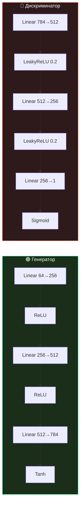
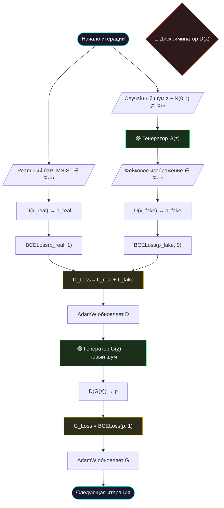
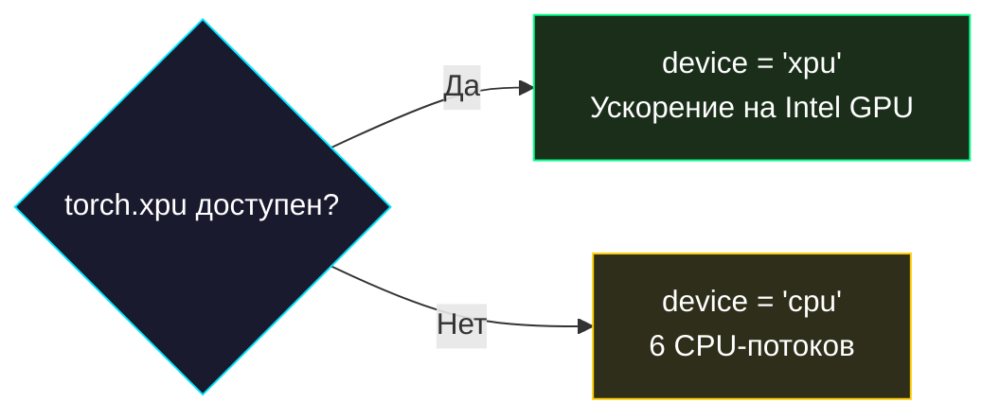
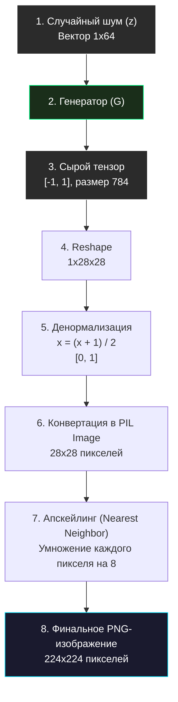
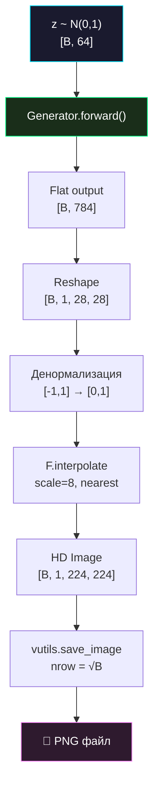

# 🧠 Архитектура Repin 2.0

> [!NOTE]
> В основе Repin 2.0 лежит классическая архитектура GAN (Generative Adversarial Network), оптимизированная для работы с изображениями 28×28 и последующего художественного апскейлинга. Этот документ содержит подробный разбор каждого компонента.

## 📋 Оглавление
1. [🧱 Компоненты модели](#-компоненты-модели)
2. [📐 Математика GAN](#-математика-gan)
3. [📊 Схема работы](#-схема-работы)
4. [🔄 Цикл обучения](#-цикл-обучения)
5. [⚡ Оптимизации](#-оптимизации)
6. [🎨 Пайплайн генерации](#-пайплайн-генерации)
7. [📏 Размерности тензоров](#-размерности-тензоров)
8. [📚 Глоссарий](#-глоссарий)

---

## 🧱 Компоненты модели

### 1. Генератор (Generator)

Многослойный перцептрон (MLP), который превращает случайный шум в изображение. Его задача — обмануть Дискриминатор, создавая всё более реалистичные подделки.

```
Вход: z ∈ ℝ⁶⁴ (случайный шум из нормального распределения)

Слой 1: Linear(64 → 256)   + ReLU
Слой 2: Linear(256 → 512)  + ReLU
Слой 3: Linear(512 → 784)  + Tanh

Выход: x_fake ∈ [-1, 1]⁷⁸⁴ (развернутое изображение 28×28)
```

| Параметр | Значение | Обоснование |
| :--- | :--- | :--- |
| **Латентная размерность** | 64 | Баланс между разнообразием и стабильностью обучения |
| **Скрытый размер** | 256 → 512 | Постепенное расширение для извлечения сложных паттернов |
| **Выходная активация** | `Tanh` | Нормализация выхода в диапазон [-1, 1], совпадающий с нормализацией входных данных |
| **Скрытая активация** | `ReLU` | Стандарт для генеративных моделей — быстрое обучение, отсутствие затухания градиента |
| **Кол-во параметров** | ~530 000 | Лёгкая модель, обучаемая на CPU |

> [!TIP]
> **Почему ReLU, а не LeakyReLU?** В генераторе «мёртвые нейроны» менее критичны, чем в дискриминаторе. ReLU обеспечивает более чёткие градиенты и быстрее сходится при генерации.

### 2. Дискриминатор (Discriminator)

Критик-классификатор, обучающийся отличать реальные изображения MNIST от подделок Генератора. Его задача — выставлять метку «1» для настоящих данных и «0» для фейков.

```
Вход: x ∈ ℝ⁷⁸⁴ (развернутое изображение 28×28)

Слой 1: Linear(784 → 512) + LeakyReLU(0.2)
Слой 2: Linear(512 → 256) + LeakyReLU(0.2)
Слой 3: Linear(256 → 1)   + Sigmoid

Выход: p ∈ [0, 1] (вероятность того, что вход — реальное изображение)
```

| Параметр | Значение | Обоснование |
| :--- | :--- | :--- |
| **Входная размерность** | 784 | 28 × 28 пикселей, развёрнутых в вектор |
| **Скрытый размер** | 512 → 256 | Постепенное сжатие (bottle-neck) для извлечения ключевых признаков |
| **Скрытая активация** | `LeakyReLU(0.2)` | Предотвращает «dying neurons» — нейроны с нулевым градиентом |
| **Выходная активация** | `Sigmoid` | Вывод вероятности в диапазоне [0, 1] для BCE loss |
| **Кол-во параметров** | ~530 000 | Симметрично генератору для баланса обучения |

> [!IMPORTANT]
> **Зеркальная архитектура.** Генератор и Дискриминатор имеют примерно одинаковое количество параметров (~530K каждый). Это критически важно: если одна сеть сильно доминирует, обучение становится нестабильным.

### Сравнительная таблица архитектур



---

## 📐 Математика GAN

### Минимаксная игра (Minimax Game)

Обучение GAN формулируется как антагонистическая игра с нулевой суммой между Генератором (G) и Дискриминатором (D). Математически это выражается через функцию ценности `V(D, G)`:

`\min_G \max_D V(D, G) = \mathbb{E}_{x \sim p_{data}(x)}[\log D(x)] + \mathbb{E}_{z \sim p_z(z)}[\log(1 - D(G(z)))]`

**Что это значит:**
- **Дискриминатор (max D)** хочет максимизировать эту функцию: он стремится выдавать `D(x) = 1` для реальных картинок (первый член) и `D(G(z)) = 0` для подделок (тогда `1 - 0 = 1`, логарифм от 1 равен 0, что является максимумом).
- **Генератор (min G)** хочет минимизировать эту функцию (а именно второй член): он стремится, чтобы `D(G(z)) = 1` (Дискриминатор ошибся). В этом случае `1 - 1 = 0`, и логарифм уходит в минус бесконечность (минимизация).

*На практике в коде мы используем BCELoss, которая является программной реализацией этой математической идеи.*

### Активационные функции в деталях

#### Генератор: Почему Tanh?
На выходе Генератора стоит функция `Tanh()` (гиперболический тангенс).
- **Диапазон:** `[-1, 1]`.
- **Причина:** Датасет MNIST нормализуется в диапазон `[-1, 1]` (преобразование `transforms.Normalize(0.5, 0.5)`). Чтобы Генератор мог создавать пиксели такой же интенсивности, его выход должен совпадать с диапазоном реальных данных. Кроме того, градиенты `Tanh` сильнее, чем у `Sigmoid`, что ускоряет обучение.

#### Дискриминатор: Почему LeakyReLU?
В скрытых слоях Дискриминатора используется `LeakyReLU(0.2)`.
- **Проблема ReLU:** Обычный `ReLU` обнуляет отрицательные значения (`max(0, x)`). Если Дискриминатор становится слишком самоуверенным и выдает большие отрицательные значения для фейков, обычный ReLU убьет градиент (он станет равен 0). Генератор перестанет получать сигнал для обучения (затухание градиента).
- **Решение:** `LeakyReLU` пропускает небольшой отрицательный градиент (`0.2 * x` для `x < 0`), гарантируя, что информация всегда будет течь обратно к Генератору.

#### Дискриминатор: Почему Sigmoid?
На выходе Дискриминатора стоит `Sigmoid()`.
- **Диапазон:** `[0, 1]`.
- **Причина:** Дискриминатор решает задачу бинарной классификации. Выход `Sigmoid` интерпретируется как вероятность того, что изображение настоящее (1) или подделка (0).

### Прямое распространение (Forward Pass)
Вектор данных проходит через слои, выполняя матричные умножения:
`H = Activation(W \cdot X + b)`
Где `W` — матрица весов, `X` — входной вектор, `b` — вектор смещения (bias). Для полносвязных слоев (MLP), каждый нейрон связан со всеми нейронами предыдущего слоя.

### Минимаксная игра (Minimax Game)

Обучение GAN формулируется как антагонистическая игра с нулевой суммой между Генератором (G) и Дискриминатором (D). Математически это выражается через функцию ценности `V(D, G)`:

`\min_G \max_D V(D, G) = \mathbb{E}_{x \sim p_{data}(x)}[\log D(x)] + \mathbb{E}_{z \sim p_z(z)}[\log(1 - D(G(z)))]`

**Что это значит:**
- **Дискриминатор (max D)** хочет максимизировать эту функцию: он стремится выдавать `D(x) = 1` для реальных картинок (первый член) и `D(G(z)) = 0` для подделок (тогда `1 - 0 = 1`, логарифм от 1 равен 0, что является максимумом).
- **Генератор (min G)** хочет минимизировать эту функцию (а именно второй член): он стремится, чтобы `D(G(z)) = 1` (Дискриминатор ошибся). В этом случае `1 - 1 = 0`, и логарифм уходит в минус бесконечность (минимизация).

*На практике в коде мы используем BCELoss, которая является программной реализацией этой математической идеи.*

### Активационные функции в деталях

#### Генератор: Почему Tanh?
На выходе Генератора стоит функция `Tanh()` (гиперболический тангенс).
- **Диапазон:** `[-1, 1]`.
- **Причина:** Датасет MNIST нормализуется в диапазон `[-1, 1]` (преобразование `transforms.Normalize(0.5, 0.5)`). Чтобы Генератор мог создавать пиксели такой же интенсивности, его выход должен совпадать с диапазоном реальных данных. Кроме того, градиенты `Tanh` сильнее, чем у `Sigmoid`, что ускоряет обучение.

#### Дискриминатор: Почему LeakyReLU?
В скрытых слоях Дискриминатора используется `LeakyReLU(0.2)`.
- **Проблема ReLU:** Обычный `ReLU` обнуляет отрицательные значения (`max(0, x)`). Если Дискриминатор становится слишком самоуверенным и выдает большие отрицательные значения для фейков, обычный ReLU убьет градиент (он станет равен 0). Генератор перестанет получать сигнал для обучения (затухание градиента).
- **Решение:** `LeakyReLU` пропускает небольшой отрицательный градиент (`0.2 * x` для `x < 0`), гарантируя, что информация всегда будет течь обратно к Генератору.

#### Дискриминатор: Почему Sigmoid?
На выходе Дискриминатора стоит `Sigmoid()`.
- **Диапазон:** `[0, 1]`.
- **Причина:** Дискриминатор решает задачу бинарной классификации. Выход `Sigmoid` интерпретируется как вероятность того, что изображение настоящее (1) или подделка (0).

### Прямое распространение (Forward Pass)
Вектор данных проходит через слои, выполняя матричные умножения:
`H = Activation(W \cdot X + b)`
Где `W` — матрица весов, `X` — входной вектор, `b` — вектор смещения (bias). Для полносвязных слоев (MLP), каждый нейрон связан со всеми нейронами предыдущего слоя.

### Функция потерь (Minimax Game)

GAN решает следующую задачу оптимизации:

```
min_G max_D V(D, G) = 𝔼[log D(x)] + 𝔼[log(1 - D(G(z)))]
```

Где:
- **D(x)** — вероятность, назначаемая Дискриминатором реальным данным
- **G(z)** — изображение, сгенерированное из шума z
- **D(G(z))** — вероятность, назначаемая сгенерированным данным

### Binary Cross-Entropy Loss (BCELoss)

На практике используется `nn.BCELoss`, которая вычисляет:

```
Loss = -(y · log(ŷ) + (1 - y) · log(1 - ŷ))
```

| Компонент | Label (y) | Вход (ŷ) | Цель |
| :--- | :--- | :--- | :--- |
| **D на реальных** | 1 | D(x_real) | D должен выводить → 1 |
| **D на фейках** | 0 | D(G(z)) | D должен выводить → 0 |
| **G через D** | 1 | D(G(z)) | G хочет, чтобы D выводил → 1 |

> [!NOTE]
> **Трюк обучения генератора.** Вместо минимизации `log(1 - D(G(z)))` (что даёт слабые градиенты на ранних этапах), Repin 2.0 максимизирует `log(D(G(z)))` — это обеспечивает более сильный сигнал обучения.

### Оптимизатор AdamW

```
θ_{t+1} = θ_t - lr · (m̂_t / (√v̂_t + ε)) - lr · λ · θ_t
```

| Параметр | Значение | Описание |
| :--- | :--- | :--- |
| `lr` | 0.0002 | Learning rate — скорость обучения |
| `beta1` | 0.5 | Коэффициент экспоненциального скользящего среднего для первого момента |
| `beta2` | 0.999 | Коэффициент для второго момента |
| `weight_decay` | 1e-4 | L2-регуляризация (decoupled от адаптивных шагов) |

> [!TIP]
> **Почему beta1 = 0.5, а не стандартные 0.9?** Пониженное значение beta1 уменьшает «инерцию» оптимизатора, что критически важно для нестационарной задачи GAN, где распределение данных для дискриминатора постоянно меняется.

### Подробно о BCELoss (Binary Cross-Entropy Loss)

В Repin 2.0 используется бинарная кросс-энтропия. Математически она описывается формулой:

`L_n = - w_n [ y_n \cdot \log(x_n) + (1 - y_n) \cdot \log(1 - x_n) ]`

Где:
- `y_n` — это метка (1 для настоящих картинок, 0 для фейковых).
- `x_n` — предсказание Дискриминатора (вероятность от 0 до 1, что картинка настоящая).

**Как это работает в коде:**
1. Когда мы обучаем Дискриминатор на **реальных** изображениях, `y_n = 1`. Формула сокращается до `- \log(x_n)`. Дискриминатор стремится сделать `x_n` близким к 1, чтобы минимизировать Loss.
2. Когда мы обучаем Дискриминатор на **фейковых** изображениях, `y_n = 0`. Формула сокращается до `- \log(1 - x_n)`. Дискриминатор стремится сделать `x_n` близким к 0.
3. Когда мы обучаем **Генератор**, мы прогоняем его картинки через Дискриминатор, но ставим `y_n = 1` (мы пытаемся "обмануть" Дискриминатор). Генератор минимизирует `- \log(x_n)`, заставляя Дискриминатор выдавать высокие вероятности.

### Подробно о BCELoss (Binary Cross-Entropy Loss)

В Repin 2.0 используется бинарная кросс-энтропия. Математически она описывается формулой:

`L_n = - w_n [ y_n \cdot \log(x_n) + (1 - y_n) \cdot \log(1 - x_n) ]`

Где:
- `y_n` — это метка (1 для настоящих картинок, 0 для фейковых).
- `x_n` — предсказание Дискриминатора (вероятность от 0 до 1, что картинка настоящая).

**Как это работает в коде:**
1. Когда мы обучаем Дискриминатор на **реальных** изображениях, `y_n = 1`. Формула сокращается до `- \log(x_n)`. Дискриминатор стремится сделать `x_n` близким к 1, чтобы минимизировать Loss.
2. Когда мы обучаем Дискриминатор на **фейковых** изображениях, `y_n = 0`. Формула сокращается до `- \log(1 - x_n)`. Дискриминатор стремится сделать `x_n` близким к 0.
3. Когда мы обучаем **Генератор**, мы прогоняем его картинки через Дискриминатор, но ставим `y_n = 1` (мы пытаемся "обмануть" Дискриминатор). Генератор минимизирует `- \log(x_n)`, заставляя Дискриминатор выдавать высокие вероятности.

---

## 📊 Схема работы

### Полный цикл обучения (1 итерация)



---

## 🔄 Цикл обучения

### Пошаговое описание одной итерации

#### Фаза 1: Обучение дискриминатора

```python
# 1. Берём реальный батч (128 изображений)
images = images.view(batch_size, -1)  # [128, 784]

# 2. D оценивает реальные данные
outputs = D(images)                    # [128, 1]  — должно быть ≈ 1
d_loss_real = BCELoss(outputs, ones)   # Штраф за отклонение от 1

# 3. Генератор создаёт фейки
z = randn(batch_size, 64)             # [128, 64] — случайный шум
fake_images = G(z)                     # [128, 784]

# 4. D оценивает фейки (без градиентов для G!)
outputs = D(fake_images.detach())      # [128, 1]  — должно быть ≈ 0
d_loss_fake = BCELoss(outputs, zeros)  # Штраф за отклонение от 0

# 5. Суммарная ошибка D и обновление весов
d_loss = d_loss_real + d_loss_fake
d_loss.backward()
d_optimizer.step()
```

#### Фаза 2: Обучение генератора

```python
# 1. Генерируем новый батч фейков
z = randn(batch_size, 64)             # [128, 64]
fake_images = G(z)                     # [128, 784]

# 2. D оценивает фейки (но теперь G получает градиенты!)
outputs = D(fake_images)              # [128, 1]

# 3. G хочет, чтобы D принял фейки за реальные
g_loss = BCELoss(outputs, ones)       # Штраф, если D не обманут
g_loss.backward()
g_optimizer.step()
```

> [!WARNING]
> **`fake_images.detach()` в фазе D** — это критически важный приём. Без `detach()` обратное распространение ошибки дискриминатора обновит также веса генератора, что приведёт к нестабильному обучению.

### Динамика loss-функций

На типичном обучении в 50 эпох вы будете наблюдать следующие паттерны:

| Эпоха | D Loss | G Loss | Комментарий |
| :--- | :--- | :--- | :--- |
| 1–5 | ~1.2–1.4 | ~0.7–1.0 | Начало — оба учатся с нуля |
| 5–15 | ~0.8–1.0 | ~1.5–2.5 | D учится быстрее, G отстаёт |
| 15–30 | ~0.7–0.9 | ~1.0–2.0 | G догоняет, начинается «игра» |
| 30–50 | ~0.5–0.8 | ~1.0–1.5 | Стабилизация — баланс достигнут |

> [!TIP]
> **Идеальный баланс** — когда D Loss ≈ 0.6–0.7 (D не уверен, реальное это или фейк). Если D Loss → 0, Генератор не получает полезных градиентов.

---

## ⚡ Оптимизации

### Intel XPU & bfloat16

Система автоматически проверяет наличие ускорителей Intel. Использование типа данных `bfloat16` позволяет:
- **Снизить потребление памяти** — веса и активации занимают вдвое меньше RAM.
- **Ускорить вычисления** — на поддерживаемом оборудовании Intel XPU (Arc, Flex серии).
- **Сохранить точность** — формат bfloat16 имеет тот же диапазон экспоненты, что и float32, поэтому не подвержен overflow.



#### Сравнение производительности (оценочное)

| Конфигурация | Время на эпоху | Время на 50 эпох |
| :--- | :--- | :--- |
| CPU (6 потоков, i5) | ~25–35 сек | ~25–30 мин |
| CPU (6 потоков, i7) | ~15–20 сек | ~15–17 мин |
| Intel XPU (Arc A770) | ~3–5 сек | ~3–4 мин |
| Intel XPU + bfloat16 | ~2–3 сек | ~2–3 мин |

### Art Upscaling

Вместо стандартного сглаживания (bilinear, bicubic) при увеличении, Repin 2.0 использует метод **Nearest Neighbor** (ближайший сосед).


- **Почему Nearest Neighbor?** Bilinear/Bicubic создают мыльные, размытые изображения. Nearest Neighbor сохраняет каждый пиксель как чёткий квадрат — идеально для эстетики пиксель-арта.
- **Результат:** Каждый пиксель 28×28 становится квадратом 8×8 пикселей, создавая эффект «цифровой мозаики».
- **Без потерь:** Это чисто геометрическая операция, не требующая интерполяции значений.

---

## 📏 Размерности тензоров

Полная карта размерностей на каждом этапе пайплайна (batch_size = 128):

| Этап | Тензор | Размерность | Dtype |
| :--- | :--- | :--- | :--- |
| Шум | `z` | `[128, 64]` | float32 / bfloat16 |
| Генератор, слой 1 | hidden | `[128, 256]` | bfloat16 |
| Генератор, слой 2 | hidden | `[128, 512]` | bfloat16 |
| Генератор, выход | `x_fake` | `[128, 784]` | bfloat16 → float32 |
| Reshape | image | `[128, 1, 28, 28]` | float32 |
| Upscale | image_hd | `[128, 1, 224, 224]` | float32 |
| Дискриминатор, вход | `x` | `[128, 784]` | bfloat16 |
| Дискриминатор, слой 1 | hidden | `[128, 512]` | bfloat16 |
| Дискриминатор, слой 2 | hidden | `[128, 256]` | bfloat16 |
| Дискриминатор, выход | `p` | `[128, 1]` | bfloat16 → float32 |

---


## 🎨 Пайплайн генерации и Апскейлинг

Процесс превращения сырого тензора в финальное изображение включает несколько важных шагов. Особенность Repin 2.0 — это намеренный пиксель-арт стиль, который достигается с помощью алгоритма `Nearest Neighbor`.

### Блок-схема генерации и апскейлинга



### Почему Nearest Neighbor?
Стандартные методы апскейлинга (Bilinear, Bicubic) пытаются "сгладить" изображение при увеличении. Для изображений 28x28 это приводит к сильному размытию (эффект "мыла"). Метод `Nearest Neighbor` (ближайший сосед) просто дублирует пиксели, сохраняя их жесткие края. Это превращает размытое маленькое пятно в стильный пиксельный объект.




---

## 📚 Глоссарий

| Термин | Описание |
| :--- | :--- |
| **MLP** | Multi-Layer Perceptron — простейшая форма нейронной сети прямого распространения. |
| **AdamW** | Продвинутый алгоритм оптимизации с раздельным weight decay. |
| **bfloat16** | Brain Floating Point — 16-битный формат, разработанный Google Brain для ML. |
| **BCELoss** | Binary Cross-Entropy — стандартная loss-функция для бинарной классификации. |
| **Minimax** | Стратегия игры с нулевой суммой — основа теории GAN. |
| **Mode Collapse** | Патология GAN, когда генератор «схлопывается» к одному/нескольким образцам. |
| **Gradient Vanishing** | Затухание градиентов в глубоких сетях — решается LeakyReLU. |
| **Latent Space** | Пространство входных векторов генератора; каждая точка = потенциальное изображение. |
| **Detach** | Операция отсечения графа вычислений — предотвращает нежелательное обратное распространение. |
| **Non-blocking** | Асинхронная передача данных на устройство — повышает пропускную способность. |

<p align="center">
  <a href="INDEX.md">← Назад: Главная</a> | <a href="usage.md">Далее: Использование →</a><br/>
  <sub>Repin 2.0 • Architecture Guide • 2026</sub>
</p>
