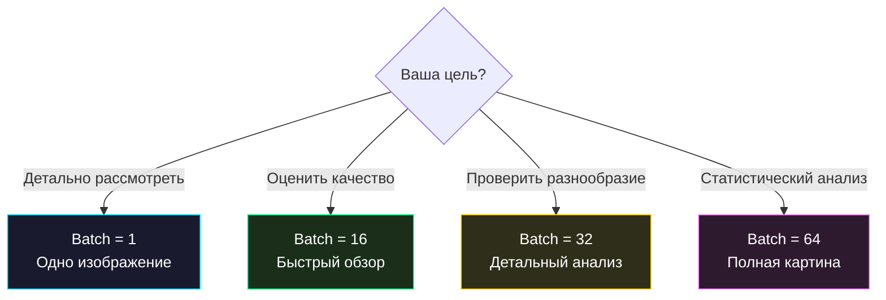

# 🖼 Руководство по продвинутой генерации

> [!TIP]
> Этот туториал поможет вам получить максимум от генеративных возможностей Repin 2.0 — от выбора batch size до анализа результатов и экспериментов.

## 📋 Оглавление
1. [🎯 Выбор batch size](#1-выбор-batch-size)
2. [🔄 Серийная генерация](#2-серийная-генерация)
3. [🔬 Анализ результатов](#3-анализ-результатов)
4. [🎨 Пайплайн Art Upscaling](#4-пайплайн-art-upscaling)
5. [🧪 Эксперименты с латентным пространством](#5-эксперименты-с-латентным-пространством)
6. [💡 Советы и трюки](#6-советы-и-трюки)

---

## 1. Выбор batch size

Batch size при генерации определяет количество изображений в одном файле. Repin 2.0 предлагает 4 варианта:

### Сравнение вариантов

| Batch | Сетка | Разрешение файла | Размер | Применение |
| :---: | :---: | :--- | :--- | :--- |
| **1** | 1×1 | 224×224 px | ~15 КБ | Изучение одного образца |
| **16** | 4×4 | ~900×900 px | ~100 КБ | Быстрый обзор качества |
| **32** | ~5×6 | ~1200×1400 px | ~180 КБ | Промежуточный вариант |
| **64** | 8×8 | ~1800×1800 px | ~350 КБ | Полная оценка разнообразия |

### Когда какой использовать



> [!TIP]
> Начните с **batch = 16** — это оптимальный размер для визуальной оценки. Используйте **batch = 64** когда хотите убедиться, что модель генерирует все 10 цифр.

---

## 2. Серийная генерация

### Множественные запуски

Каждый запуск генерации создаёт **уникальный** набор изображений (новый случайный шум). Чтобы получить разнообразную коллекцию:

1. Запустите `python cli.py`
2. Выберите **[ 2 ]** → batch 16
3. Нажмите Enter → снова **[ 2 ]** → batch 16
4. Повторите 5–10 раз

### Результат

В `generated_art/` появятся файлы с разными метками времени:

```
generated_art/
├── repin_batch_16_20260501_024500.png
├── repin_batch_16_20260501_024512.png
├── repin_batch_16_20260501_024525.png
├── repin_batch_16_20260501_024538.png
└── repin_batch_16_20260501_024551.png
```

> [!NOTE]
> Каждый файл полностью уникален. Вы можете генерировать сколько угодно батчей — они не перезаписывают друг друга благодаря меткам времени.

---

## 3. Анализ результатов

### Критерии оценки

При просмотре сгенерированных изображений обращайте внимание на:

| Критерий | Хороший результат | Плохой результат | Что делать |
| :--- | :--- | :--- | :--- |
| **Узнаваемость** | Цифры легко читаются | Аморфные пятна | Больше эпох обучения |
| **Разнообразие** | Видны все/большинство цифр 0–9 | Только 1–2 типа цифр | Переобучить модель |
| **Контрастность** | Чёткий белый на чёрном | Серый шум | Проверить нормализацию |
| **Форма** | Плавные, характерные изгибы | Прямые линии, квадраты | Больше эпох или hidden_size |
| **Толщина штриха** | Разнообразная, как у человека | Одинаково тонкая/толстая | Увеличить latent_size |

### Распределение цифр

В идеале генератор должен создавать все 10 цифр примерно равномерно. На практике некоторые цифры (1, 7) проще для модели, а другие (8, 9) — сложнее.

**Типичное распределение после 50 эпох:**

| Цифра | Частота | Комментарий |
| :---: | :--- | :--- |
| 0 | ⬛⬛⬛⬛ | Стандартная |
| 1 | ⬛⬛⬛⬛⬛⬛ | Простая форма, часто встречается |
| 2 | ⬛⬛⬛ | Средняя |
| 3 | ⬛⬛⬛ | Средняя |
| 4 | ⬛⬛⬛ | Средняя |
| 5 | ⬛⬛ | Сложная форма |
| 6 | ⬛⬛⬛ | Средняя |
| 7 | ⬛⬛⬛⬛⬛ | Простая форма |
| 8 | ⬛⬛ | Сложная (два кольца) |
| 9 | ⬛⬛ | Сложная |

---

## 4. Пайплайн Art Upscaling

### Как работает увеличение

Repin 2.0 использует **Nearest Neighbor** интерполяцию для увеличения изображений:

```
Оригинал (28×28) → Nearest Neighbor ×8 → HD (224×224)
```

### Почему Nearest Neighbor?

| Метод | Результат | Для Repin |
| :--- | :--- | :--- |
| **Bilinear** | Мягкие, размытые переходы | ❌ Теряется пиксельная структура |
| **Bicubic** | Ещё более плавное сглаживание | ❌ Слишком «мыльно» |
| **Nearest Neighbor** | Каждый пиксель = чёткий квадрат | ✅ Эффект пиксель-арта |

### Эффект «цифровой мозаики»

Каждый пиксель оригинального изображения 28×28 становится квадратом 8×8 пикселей в увеличенной версии. Это создаёт характерную эстетику ретро-пиксель-арта.

```
Один пиксель оригинала:     Один «плитка» после upscale:
  ┌─┐                         ┌───────────┐
  │█│          × 8 →          │███████████│
  └─┘                         │███████████│
                               │███████████│
                               │███████████│
                               │███████████│
                               │███████████│
                               │███████████│
                               │███████████│
                               └───────────┘
```

---

## 5. Эксперименты с латентным пространством

### Что такое латентное пространство?

Каждый вектор шума `z ∈ ℝ⁶⁴` — это точка в 64-мерном латентном пространстве. Генератор «научился» отображать каждую точку этого пространства в изображение цифры.

### Фиксированный шум

Для сравнения моделей можно использовать один и тот же шум. Добавьте в `cli.py`:

```python
# Фиксированный шум для воспроизводимости
torch.manual_seed(42)
z = torch.randn(batch_size, latent_size)
```

> [!NOTE]
> `torch.manual_seed(42)` гарантирует, что один и тот же шум генерируется при каждом запуске. Это полезно для сравнения разных моделей: обучите с разными гиперпараметрами, затем сгенерируйте с одинаковым шумом и сравните.

### Интерполяция в латентном пространстве

Продвинутый эксперимент: плавный переход между двумя шумовыми векторами. Это можно реализовать вручную:

```python
z1 = torch.randn(1, latent_size)  # Начальная точка
z2 = torch.randn(1, latent_size)  # Конечная точка

# 10 промежуточных точек
steps = 10
images = []
for i in range(steps):
    alpha = i / (steps - 1)
    z = (1 - alpha) * z1 + alpha * z2  # Линейная интерполяция
    img = G(z.to(device))
    images.append(img)
```

Результат покажет плавный переход одной цифры в другую.

---

## 6. Советы и трюки

### Быстрая оценка модели

Генерируйте несколько батчей по 64 изображения. Если в каждом батче видны разные цифры (0–9) — модель обучена хорошо.

### Лучшее время для генерации

Генерация практически мгновенна (< 1 секунды) на любом устройстве, так как:
- Используется только Generator (не нужен Discriminator)
- Режим `eval()` + `no_grad()` — нет вычисления градиентов
- `autocast(bfloat16)` — вдвое меньше памяти

### Организация коллекции

```bash
# Создайте подпапки для разных экспериментов
mkdir generated_art/epoch_10
mkdir generated_art/epoch_50
mkdir generated_art/epoch_100
```

### Таблица скорости генерации

| Batch size | CPU | Intel XPU |
| :---: | :--- | :--- |
| 1 | < 0.1 сек | < 0.05 сек |
| 16 | < 0.2 сек | < 0.1 сек |
| 32 | < 0.3 сек | < 0.1 сек |
| 64 | < 0.5 сек | < 0.2 сек |

> [!TIP]
> Генерация настолько быстрая, что задержка в 0.5 секунды добавлена **специально** (`time.sleep(0.5)`) для визуального эффекта спиннера.

<p align="center">
  <a href="hyperparameters.md">← Назад: Гиперпараметры</a> | <a href="../INDEX.md">В начало раздела →</a><br/>
  <sub>Repin 2.0 • Tutorials • 2026</sub>
</p>
