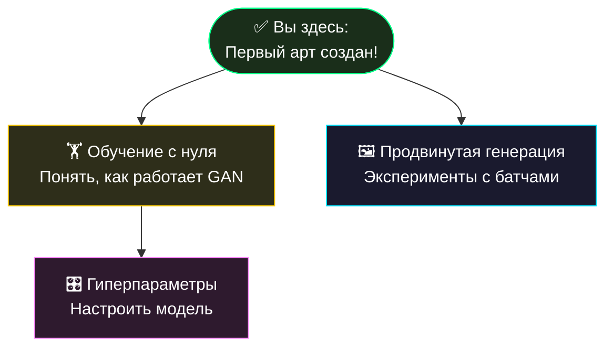

# 🚀 Быстрый старт: Создаем первый арт

> [!TIP]
> Этот туториал проведёт вас от установки до первого сгенерированного изображения. Если у вас уже есть файл `repin_weights.pth`, переходите сразу к [шагу 3](#3-запуск-генерации).

## 📋 Оглавление
1. [📥 Установка зависимостей](#1-установка-зависимостей)
2. [🔍 Проверка окружения](#2-проверка-окружения)
3. [🎨 Запуск генерации](#3-запуск-генерации)
4. [🖼 Просмотр и анализ результата](#4-просмотр-и-анализ-результата)
5. [🔄 Что дальше?](#5-что-дальше)

---

## 1. Установка зависимостей

### Минимальная установка

```bash
pip install torch torchvision rich
```

### Рекомендуемая установка (с виртуальным окружением)

```bash
# Создаём изолированное окружение
python -m venv .venv

# Активируем его
# Windows (PowerShell):
.venv\Scripts\Activate.ps1
# Windows (CMD):
.venv\Scripts\activate.bat
# Linux / macOS:
source .venv/bin/activate

# Устанавливаем зависимости
pip install torch torchvision rich
```

### Проверка версий

```bash
python -c "import torch; print(f'PyTorch: {torch.__version__}')"
python -c "import torchvision; print(f'TorchVision: {torchvision.__version__}')"
python -c "import rich; print(f'Rich: {rich.__version__}')"
```

**Ожидаемый вывод:**
```
PyTorch: 2.x.x
TorchVision: 0.1x.x
Rich: 13.x.x
```

> [!WARNING]
> Если `PyTorch` показывает версию ниже 2.0, обновите: `pip install --upgrade torch torchvision`

---

## 2. Проверка окружения

Убедитесь, что всё настроено:

```bash
python -c "
import torch, torchvision, rich, os
print('✅ Все зависимости установлены')
print(f'   PyTorch:  {torch.__version__}')
xpu = hasattr(torch, 'xpu') and torch.xpu.is_available()
print(f'   XPU:      {\"Доступен ✨\" if xpu else \"Нет (CPU mode)\"}')
print(f'   Threads:  {torch.get_num_threads()}')
weights = os.path.exists('repin_weights.pth')
print(f'   Weights:  {\"Найдены ✅\" if weights else \"Не найдены (нужно обучение)\"}')
"
```

Проверьте наличие файла `repin_weights.pth` в корневой директории. 

| Статус | Действие |
| :--- | :--- |
| ✅ Файл существует | Переходите к [шагу 3](#3-запуск-генерации) |
| ❌ Файл отсутствует | Сначала пройдите [туториал по обучению](training.md) |

---

## 3. Запуск генерации

### Шаг 1: Запустите CLI

```bash
python cli.py
```

Вы увидите красочное ASCII-меню:

```
╭──────────────── Welcome ─────────────────╮
│                                          │
│   ██████╗ ███████╗██████╗ ██╗███╗   ██╗  │
│   ██╔══██╗██╔════╝██╔══██╗██║████╗  ██║  │
│   ██████╔╝█████╗  ██████╔╝██║██╔██╗ ██║  │
│   ██╔══██╗██╔══╝  ██╔═══╝ ██║██║╚██╗██║  │
│   ██║  ██║███████╗██║     ██║██║ ╚████║  │
│   ╚═╝  ╚═╝╚══════╝╚═╝     ╚═╝╚═╝  ╚═══╝│
│                                          │
│   Простая GAN модель для генерации цифр   │
│                                          │
╰───────────────── Device: CPU ────────────╯
```

### Шаг 2: Выберите генерацию

Введите **2** и нажмите **Enter** (или просто **Enter** — это действие по умолчанию).

### Шаг 3: Выберите количество изображений

Программа предложит выбрать batch size:

| Ввод | Результат |
| :---: | :--- |
| `1` | Одно изображение (для точечного анализа) |
| `16` | Сетка 4×4 (рекомендуется для начала) |
| `32` | Сетка ~5×6 |
| `64` | Сетка 8×8 (максимальный обзор) |

Введите **16** и нажмите **Enter**.

### Шаг 4: Дождитесь результата

Появится анимированный спиннер, а затем:

```
✨ Успех! Сгенерировано 16 изображений.
📁 Файл сохранен: generated_art/repin_batch_16_20260501_024500.png
```

---

## 4. Просмотр и анализ результата

### Где найти файл

Перейдите в папку `generated_art/` — там вы найдете PNG-файл с сеткой цифр.

```bash
# Windows:
explorer generated_art

# Linux:
xdg-open generated_art/

# macOS:
open generated_art/
```

### Что вы увидите

Файл содержит сетку из 16 изображений (4×4), каждое — 224×224 пикселя. Это рукописные цифры, сгенерированные нейросетью из чистого шума.

### Оценка качества

| Критерий | Хорошо | Плохо |
| :--- | :--- | :--- |
| **Узнаваемость** | Цифры легко распознаются | Аморфные пятна |
| **Разнообразие** | Разные цифры (0–9) | Одна цифра повторяется |
| **Чёткость** | Пиксели чёткие (квадратные) | Размытые края |
| **Контраст** | Чёрный фон, белые цифры | Серый шум |

> [!NOTE]
> Каждое изображение **уникально**, так как оно генерируется из абсолютно случайного шума! Запустите генерацию несколько раз — вы каждый раз получите новый набор.

---

## 5. Что дальше?

### Рекомендуемые следующие шаги



| Интерес | Следующий шаг |
| :--- | :--- |
| Хочу обучить свою модель | → [Обучение с нуля](training.md) |
| Хочу улучшить качество | → [Гиперпараметры](hyperparameters.md) |
| Хочу экспериментировать | → [Продвинутая генерация](generation_guide.md) |
| Хочу понять архитектуру | → [Архитектура системы](../architecture.md) |

<p align="center">
  <a href="README.md">← Назад: Список туториалов</a> | <a href="training.md">Далее: Обучение →</a><br/>
  <sub>Repin 2.0 • Tutorials • 2026</sub>
</p>
