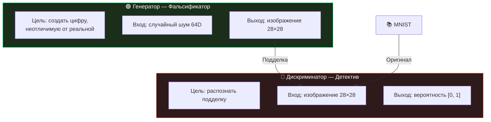
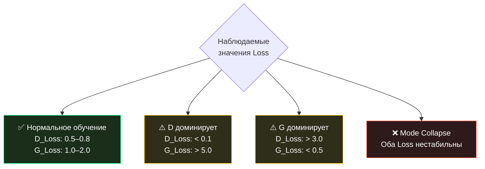
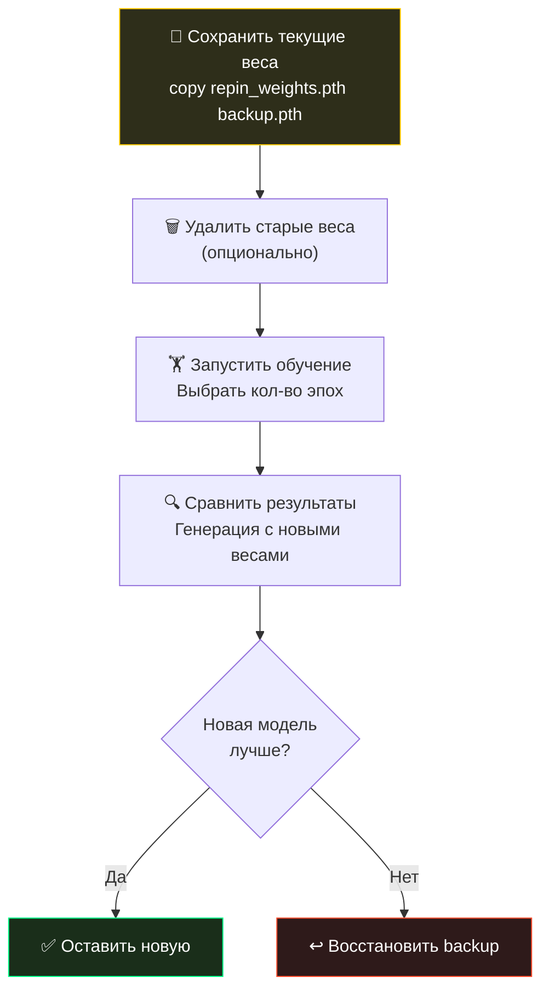

# 🏋️ Обучение новой модели

> [!IMPORTANT]
> Обучение нейросети — ресурсозатратный процесс. Убедитесь, что ваше устройство подключено к питанию и у вас достаточно свободной оперативной памяти (минимум 2 ГБ).

## 📋 Оглавление
1. [📊 Подготовка данных](#1-подготовка-данных)
2. [🚀 Запуск обучения](#2-запуск-обучения)
3. [📈 Мониторинг прогресса](#3-мониторинг-прогресса)
4. [🧮 Понимание Loss-функций](#4-понимание-loss-функций)
5. [⏱ Оценка времени обучения](#5-оценка-времени-обучения)
6. [💾 Сохранение и восстановление](#6-сохранение-и-восстановление)
7. [✅ Проверка результата](#7-проверка-результата)
8. [🔄 Переобучение](#8-переобучение)

---

## 1. Подготовка данных

### MNIST — автоматическая загрузка

Вам **не нужно** скачивать MNIST вручную. Repin 2.0 использует `torchvision.datasets.MNIST` и автоматически загружает данные при первом запуске обучения.

| Параметр | Значение |
| :--- | :--- |
| **Датасет** | MNIST (рукописные цифры 0–9) |
| **Размер** | 60 000 тренировочных образцов |
| **Разрешение** | 28×28 пикселей, градации серого |
| **Загрузка** | ~11 МБ |
| **Путь** | `data/MNIST/raw/` |

### Предобработка данных

Перед подачей в нейросеть каждое изображение проходит два преобразования:


| Преобразование | Формула | Результат |
| :--- | :--- | :--- |
| `ToTensor()` | pixel / 255 | Значения пикселей в [0, 1] |
| `Normalize(0.5, 0.5)` | (x - 0.5) / 0.5 | Значения в [-1, 1] |

> [!TIP]
> **Почему [-1, 1]?** Потому что выход генератора — `Tanh()`, который тоже выдаёт значения в диапазоне [-1, 1]. Это обеспечивает совместимость между реальными и сгенерированными данными.

---

## 2. Запуск обучения

### Пошаговая инструкция

```bash
# 1. Запустите CLI
python cli.py

# 2. В меню выберите [1] — Обучить модель
# 3. Введите количество эпох (или нажмите Enter для 50 по умолчанию)
```

### Выбор количества эпох

| Эпохи | Время (CPU i5) | Качество | Рекомендация |
| :---: | :--- | :--- | :--- |
| **1–5** | 1–3 мин | Шум, цифры не узнаваемы | Только для тестирования |
| **10–20** | 5–12 мин | Начинают появляться формы | Для быстрой проверки |
| **30–50** | 15–30 мин | Хорошо узнаваемые цифры | ✅ Рекомендуется |
| **100+** | 50+ мин | Отличное качество | Для максимального результата |

> [!NOTE]
> Больше эпох ≠ всегда лучше. После ~100 эпох модель может начать «переобучаться» (mode collapse). 50 эпох — оптимальный баланс.

### Что происходит внутри?

При каждом обучении создаются два «игрока»:



**Аналогия:** Представьте фальшивомонетчика (Генератор) и банковского эксперта (Дискриминатор). Фальшивомонетчик учится делать всё более качественные подделки, а эксперт — всё точнее их распознавать. В итоге подделки становятся неотличимы от оригинала.

---

## 3. Мониторинг прогресса

### Прогресс-бар

Благодаря библиотеке `rich`, вы увидите двойной прогресс-бар:

```
⠋ Эпохи...                            ████████████░░░░  75%  00:18:34  00:06:12
⠋ Батчи (D_Loss: 0.72, G_Loss: 1.34)  ████████████████  100% 00:00:24  00:00:00
```

| Элемент | Описание |
| :--- | :--- |
| **Спиннер (⠋)** | Анимация, показывающая активность процесса |
| **Прогресс-бар (████)** | Визуальный прогресс текущей задачи |
| **Процент (75%)** | Доля выполненной работы |
| **Elapsed (00:18:34)** | Прошедшее время |
| **ETA (00:06:12)** | Расчётное оставшееся время |

### Значения Loss

В нижней строке отображаются:

- **D_Loss** — ошибка Дискриминатора (как хорошо он отличает реальное от фейка)
- **G_Loss** — ошибка Генератора (насколько успешно он обманывает Дискриминатора)

---

## 4. Понимание Loss-функций

### Интерпретация значений



### Подробная таблица интерпретации

| D_Loss | G_Loss | Статус | Что делать |
| :--- | :--- | :--- | :--- |
| 0.5–0.8 | 1.0–2.0 | ✅ Баланс | Всё в порядке, продолжайте |
| < 0.1 | > 5.0 | ⚠️ D слишком силён | Уменьшите lr Дискриминатора или увеличите lr Генератора |
| > 3.0 | < 0.5 | ⚠️ G доминирует | Возможен mode collapse. Перезапустите обучение |
| Скачет хаотично | Скачет хаотично | ❌ Нестабильно | Уменьшите learning rate |
| ≈ 0.69 | ≈ 0.69 | 🤔 Равновесие | D выдаёт 0.5 на всё — обучение не прогрессирует |

### Типичная динамика Loss за 50 эпох

```
Эпоха  D_Loss  G_Loss  Комментарий
  1     1.38    0.71   Начало — оба учатся
  5     1.12    0.94   D начинает распознавать фейки
 10     0.91    1.47   D уверенно определяет подделки
 20     0.78    1.65   G начинает создавать узнаваемые формы
 30     0.72    1.43   Баланс — цифры становятся чётче
 40     0.68    1.31   Стабилизация
 50     0.65    1.28   ✅ Обучение завершено
```

> [!TIP]
> **Идеальный D_Loss ≈ 0.69** (= -ln(0.5)). Это означает, что Дискриминатор не может отличить реальное от сгенерированного и выдаёт вероятность 50% на оба.

---

## 5. Оценка времени обучения

### Формула расчёта

```
Общее время ≈ (эпох) × (батчей на эпоху) × (время на батч)
```

Для MNIST (60 000 изображений, batch_size = 128):
- **Батчей на эпоху:** 60000 / 128 ≈ 468
- **Время на батч (CPU):** ~50–80 мс

### Таблица ориентировочного времени

| Конфигурация | 10 эпох | 50 эпох | 100 эпох |
| :--- | :--- | :--- | :--- |
| CPU i5 (6 потоков) | ~5 мин | ~25 мин | ~50 мин |
| CPU i7 (6 потоков) | ~3 мин | ~15 мин | ~30 мин |
| Intel XPU (Arc) | ~0.5 мин | ~3 мин | ~5 мин |
| Intel XPU + bfloat16 | ~0.3 мин | ~2 мин | ~3 мин |

---

## 6. Сохранение и восстановление

### Автоматическое сохранение

После завершения **всех** эпох, веса Генератора автоматически сохраняются:

```python
torch.save(G.state_dict(), 'repin_weights.pth')
```

| Файл | Размер | Содержимое |
| :--- | :--- | :--- |
| `repin_weights.pth` | ~2.1 МБ | `state_dict` генератора (550 416 параметров) |

### Ручное резервное копирование

```bash
# Перед переобучением — скопируйте текущие веса
# Windows:
copy repin_weights.pth repin_weights_backup.pth
# Linux:
cp repin_weights.pth repin_weights_backup.pth
```

> [!WARNING]
> **Промежуточные чекпоинты не сохраняются!** Если обучение прервано (Ctrl+C, сбой питания), весь прогресс текущей сессии будет потерян. Эта функция запланирована для версии 2.1.

### Восстановление весов

Чтобы вернуть предыдущую модель:
```bash
# Windows:
copy repin_weights_backup.pth repin_weights.pth
# Linux:
cp repin_weights_backup.pth repin_weights.pth
```

---

## 7. Проверка результата

### Быстрый тест

После обучения сразу проверьте качество:

1. Нажмите **Enter** (вернуться в меню)
2. Выберите **[ 2 ]** (генерация)
3. Введите **16** (batch size)
4. Откройте файл в `generated_art/`

### Критерии успешного обучения

| Критерий | Описание | Пример |
| :--- | :--- | :--- |
| **Узнаваемость** | Цифры опознаются человеком | «Это явно 3 и 7» |
| **Разнообразие** | Генерируются разные цифры | Видны 0, 1, 3, 5, 7, 8... |
| **Контраст** | Чёткий контраст фон/цифра | Белое на чёрном |
| **Форма** | Цифры имеют характерные изгибы | Плавные округлости |

### Если результат плохой

| Симптом | Причина | Решение |
| :--- | :--- | :--- |
| Серый шум | Мало эпох | Обучите ≥ 30 эпох |
| Все одинаковые | Mode collapse | Удалите веса, обучите заново |
| Размытые формы | Недообучение | Увеличьте число эпох до 100 |

---

## 8. Переобучение

### Когда переобучать?

- Хотите улучшить качество текущей модели
- Хотите начать с чистого листа
- Текущая модель показывает признаки mode collapse

### Процедура переобучения



> [!NOTE]
> Каждое обучение начинается **с нуля** — веса инициализируются случайно. В текущей версии нет функции дообучения (fine-tuning) существующей модели.

<p align="center">
  <a href="getting_started.md">← Назад: Быстрый старт</a> | <a href="hyperparameters.md">Далее: Гиперпараметры →</a><br/>
  <sub>Repin 2.0 • Tutorials • 2026</sub>
</p>
