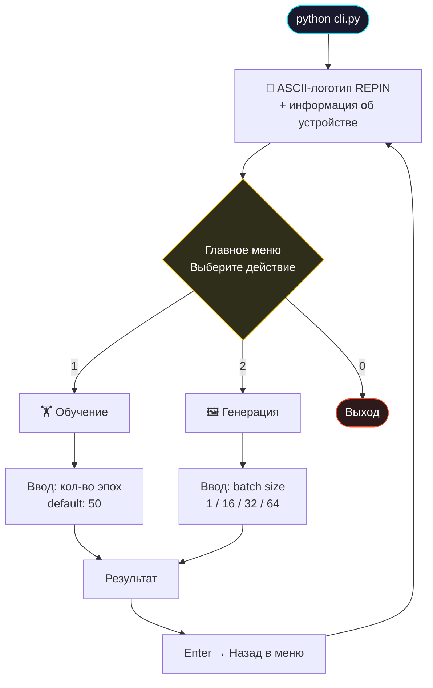
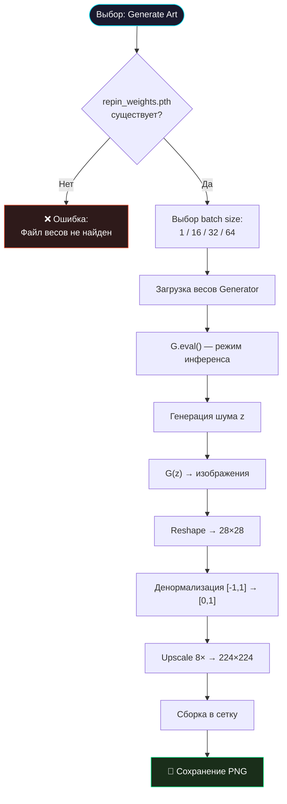

# ⚙️ Руководство по использованию CLI

> [!TIP]
> Repin 2.0 предоставляет интуитивно понятный интерактивный интерфейс на базе библиотеки `rich`. Для запуска просто выполните `python cli.py`.

## 📋 Оглавление
1. [🎮 Главное меню](#-главное-меню)
2. [🏋️ Обучение модели](#-обучение-модели)
3. [🖼 Генерация арта](#-генерация-арта)
4. [📁 Структура файлов](#-структура-файлов)
5. [⌨️ Полный цикл работы](#-полный-цикл-работы)
6. [🎛 Конфигурация по умолчанию](#-конфигурация-по-умолчанию)
7. [🖥 Требования к терминалу](#-требования-к-терминалу)

---

## 🎮 Главное меню

После запуска `python cli.py` вы увидите стилизованное ASCII-меню проекта с логотипом REPIN в блочном стиле. Интерфейс автоматически определяет устройство (CPU / XPU) и отображает его в подзаголовке панели.

### Доступные действия

| Клавиша | Действие | Описание |
| :---: | :--- | :--- |
| **1** | Обучить модель | Запуск тренировочного цикла GAN с выбором количества эпох |
| **2** | Сгенерировать арт | Создание батча изображений с выбором batch size |
| **0** | Выход | Корректное завершение программы |

> [!NOTE]
> По умолчанию при нажатии Enter без ввода числа выбирается действие **2** (генерация). Это сделано для удобства — генерация используется чаще, чем обучение.

### Навигация по меню



---

## 🏋️ Обучение модели

При выборе режима обучения (клавиша **1**) система выполняет следующие шаги:

### 1. Подготовка

| Шаг | Действие | Детали |
| :---: | :--- | :--- |
| 1 | Запрос количества эпох | По умолчанию: 50, ввод: любое целое число |
| 2 | Загрузка MNIST | Автоматическое скачивание в `data/MNIST/raw/` (при первом запуске) |
| 3 | Инициализация моделей | Generator + Discriminator переносятся на выбранное устройство |
| 4 | Создание оптимизаторов | Два независимых AdamW (для G и D) |

### 2. Процесс обучения

Обучение визуализируется двойным прогресс-баром:

```
⠋ Эпохи...                            ████████░░░░░░░░  52%  00:12:34  00:11:18
⠋ Батчи (D_Loss: 0.67, G_Loss: 1.23)  ██████████████░░  89%  00:00:22  00:00:03
```

- **Верхняя строка** — прогресс по эпохам (с ETA)
- **Нижняя строка** — прогресс по батчам в текущей эпохе + реальные значения loss

### 3. Сохранение

По завершении обучения:
- Веса генератора сохраняются в `repin_weights.pth`
- Отображается подтверждающее сообщение `✅ Обучение завершено!`
- Нажатие Enter возвращает в главное меню

> [!WARNING]
> **Перезапись весов.** Каждое новое обучение полностью перезаписывает файл `repin_weights.pth`. Если вы хотите сохранить предыдущую модель, вручную скопируйте файл весов перед началом нового обучения.

### 4. Параметры обучения (жёстко заданные)

| Параметр | Значение | Описание |
| :--- | :--- | :--- |
| `batch_size` | 128 | Количество изображений в одном батче |
| `lr` | 0.0002 | Learning rate для обоих оптимизаторов |
| `betas` | (0.5, 0.999) | Моменты AdamW |
| `weight_decay` | 1e-4 | L2-регуляризация |
| `criterion` | BCELoss | Функция потерь |
| `num_workers` | 0 | Потоки загрузки данных (0 = основной поток) |

> [!TIP]
> Для изменения этих параметров необходимо редактировать функцию `train_model()` в `cli.py`. Подробнее — в [туториале по гиперпараметрам](tutorials/hyperparameters.md).

---

## 🖼 Генерация арта

Это сердце проекта. При выборе генерации (клавиша **2**):

### Пошаговый процесс



### Доступные размеры батча

| Batch Size | Сетка (nrow) | Разрешение файла | Примерный размер файла |
| :---: | :---: | :--- | :--- |
| **1** | 1×1 | 224×224 | ~15 КБ |
| **16** | 4×4 | ~900×900 | ~100 КБ |
| **32** | 5×6~ | ~1200×1400 | ~180 КБ |
| **64** | 8×8 | ~1800×1800 | ~350 КБ |

### Формат имени файла

```
repin_batch_{batch_size}_{YYYYMMDD}_{HHMMSS}.png
```

**Пример:** `repin_batch_16_20260501_023045.png`

- `repin_batch_` — префикс проекта
- `16` — количество изображений в батче
- `20260501_023045` — дата и время генерации (год-месяц-день_час-минута-секунда)

### Визуальный индикатор

Во время генерации отображается анимированный спиннер:

```
⠏ Генерация батча из 16 изображений...
```

После завершения:
```
✨ Успех! Сгенерировано 16 изображений.
📁 Файл сохранен: generated_art/repin_batch_16_20260501_023045.png
```

---


## ⌨️ Полный цикл работы и примеры использования

### Пример 1: Быстрый тест работоспособности
Если вы только что скачали проект и хотите убедиться, что всё работает:
1. Запустите `python cli.py`
2. Выберите `1` (Обучение)
3. Введите `5` эпох. Этого недостаточно для красивых картинок, но достаточно, чтобы проверить, что обучение идет, лоссы меняются, а видеокарта используется.
4. Дождитесь завершения и выберите `2` (Генерация).
5. Проверьте папку `generated_art`.

### Пример 2: Подготовка портфолио
Вы хотите создать набор красивых пиксельных артов для публикации:
1. Запустите `python cli.py`
2. Выберите `1` и введите `100` эпох. Оставьте компьютер на 5-15 минут.
3. Выберите `2` и введите размер батча `64`.
4. Сгенерируйте так 5-10 раз подряд (просто нажимая `2` и `Enter`).
5. Откройте папку `generated_art`. У вас будет 300-600 картинок.
6. Выберите самые интересные узоры вручную — генеративное искусство часто требует ручной курации!

### 🎛 Конфигурация по умолчанию (в коде)
Если вы хотите изменить скрытые настройки, откройте файл `cli.py` и найдите следующие переменные в начале файла:
- `latent_size = 64` — размер "зерна" (seed) для генерации.
- `hidden_size = 256` — размер скрытых слоев нейросетей.
- `lr = 0.0002` — скорость обучения (в инициализации оптимизаторов).
- `epochs = 50` — значение по умолчанию, если пользователь нажал Enter без ввода числа.


### Сценарий 1: Первый запуск (нет весов)

```
1. python cli.py
2. Выбрать [1] — Обучить модель
3. Ввести количество эпох (например, 50)
4. Дождаться окончания обучения (~15–30 минут на CPU)
5. Нажать Enter
6. Выбрать [2] — Сгенерировать батч
7. Выбрать batch size (например, 16)
8. Открыть generated_art/ и посмотреть результат
```

### Сценарий 2: Повторная генерация (есть весы)

```
1. python cli.py
2. Выбрать [2] — Сгенерировать батч
3. Выбрать batch size
4. Повторить при необходимости
```

### Сценарий 3: Переобучение модели

```
1. (Опционально) Скопировать repin_weights.pth → repin_weights_backup.pth
2. python cli.py
3. Выбрать [1] — Обучить модель
4. Ввести число эпох (больше = лучше качество, но дольше)
5. Дождаться окончания
```

---

## 🎛 Конфигурация по умолчанию

Все параметры задаются в начале файла `cli.py`:

```python
# --- АППАРАТНАЯ НАСТРОЙКА ---
device = 'cpu'                # Автоопределение: 'cpu' или 'xpu'
torch.set_num_threads(6)      # Кол-во CPU-потоков (если нет XPU)

# --- НАСТРОЙКИ МОДЕЛИ ---
latent_size = 64              # Размерность вектора шума
hidden_size = 256             # Базовый размер скрытого слоя
image_size = 28 * 28          # 784 — размер развёрнутого изображения
WEIGHTS_PATH = 'repin_weights.pth'   # Путь к файлу весов
OUTPUT_DIR = 'generated_art'         # Директория для результатов
```

---

## 🖥 Требования к терминалу

Repin 2.0 использует библиотеку `rich` для красивого вывода. Для корректного отображения:

| Требование | Рекомендация |
| :--- | :--- |
| **Кодировка** | UTF-8 (поддержка Unicode-символов: ██ ╗ ║ ╔ ✨ ✅ ❌) |
| **Цвет** | Терминал с поддержкой True Color (16 миллионов цветов) |
| **Шрифт** | Моноширинный шрифт с полной поддержкой Unicode (Cascadia Code, JetBrains Mono) |
| **Ширина** | Минимум 80 символов, рекомендуется 120+ |

### Рекомендуемые терминалы

| ОС | Терминал | Статус |
| :--- | :--- | :--- |
| **Windows 11** | Windows Terminal | ✅ Отлично |
| **Windows 10** | Windows Terminal (из Store) | ✅ Отлично |
| **Windows** | CMD (устаревший) | ⚠️ Ограниченно |
| **VS Code** | Встроенный терминал | ✅ Отлично |
| **Linux** | GNOME Terminal / Alacritty / Kitty | ✅ Отлично |
| **macOS** | iTerm2 | ✅ Отлично |

<p align="center">
  <a href="architecture.md">← Назад: Архитектура</a> | <a href="tutorials/getting_started.md">Далее: Быстрый старт →</a><br/>
  <sub>Repin 2.0 • Usage Guide • 2026</sub>
</p>
