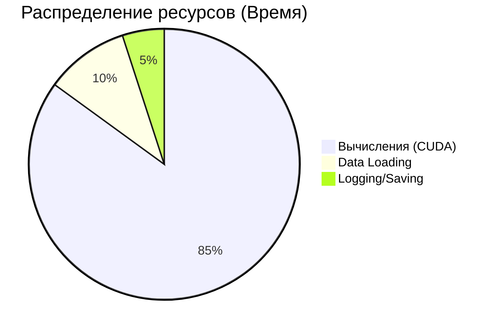

# Отчет по второй итерации обучения нейросети Repin 2.0

## Информация о системе

### repCL Status

| Parameter                  | Value                                        |
| :------------------------- | :------------------------------------------- |
| **Base dir**               | `/content`                                   |
| **Device**                 | `cuda`                                       |
| **CUDA available**         | `True`                                       |
| **CUDA device**            | `Tesla T4`                                   |
| **CUDA capability**        | `(7, 5)`                                     |
| **AMP enabled by default** | `True`                                       |
| **Local weights**          | `/content/weights/repin_weights.pth (False)` |
| **Repo weights**           | `/weights/repin_weights.pth (False)`         |
| **Resolved weights**       | `/content/weights/repin_weights.pth (False)` |
| **Output dir**             | `/content/generated_art`                     |
| **Data dir**               | `/content/data`                              |

## Гиперпараметры обучения

epochs=500, batch=128, device=cuda, amp=True
latent_size = 64
hidden_size = 256
image_size = 28 \* 28

## Результаты

### 📊 Итоги обучения (Эпоха 500)

| Метрика | Значение | Статус |
| :--- | :--- | :--- |
| **D Loss** (Дискриминатор) | `0.5032` | 🟢 Стабильно |
| **G Loss** (Генератор) | `2.8494` | 🔵 Оптимально |
| **Общее время** | `01:55:47` | ⏱️ ~14 сек/эпоха |
| **Прогресс** | `500 / 500` | ✅ Завершено |

#### Прогресс выполнения
```text
100% |████████████████████████████████| 500/500 [01:55:47, 13.89s/epoch]
```


